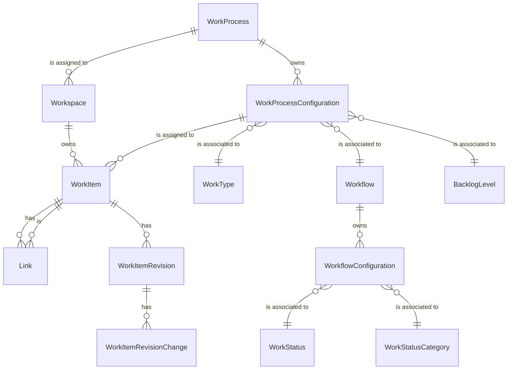

# Work Domain

# Models
- [Workspace](#workspace)
- [Work Item](#work-item)
- [Work Item Revision](#work-item-revision)
- [Work Item Revision Change](#work-item-revision-change)
- [Work Process](#work-process)
- [Work Process Configuration](#work-process-configuration)
- [Work Type](#work-type)
- [Backlog Level](#backlog-level)
- [Workflow](#workflow)
- [Workflow Configurtion](#workflow-configuration)
- [Work Status](#work-status)
- [Work Status Category](#work-status-category)

## Workspace
A workspace is a container for work items. A workspace lives within a single [organization](Organization.md).

A workspace is either owned by Moda or managed by an external application and synchronized with Moda.

## Work Item
A work item represents a piece of work that needs to be completed.

## Work Item Revision
The work item revision is a change record for a work item.

## Work Item Revision Change
A specific field change within a work item revision.

## Work Process
The work process defines a set of work process configurations that can be used within a workspace.  A work process can be used in many workspaces.

### Business Rules
- A work process requires at least one work type to be configured.
- A work type can only be defined once within a work process.
- A single work process can be used by multiple workspaces.

## Work Process Configuration
The work process configuration links work types with workflows and defines the backlog level for each to the work process.

## Work Type
Represents the type of work item.  Examples:
- Story
- Bug
- Feature
- Epic

## Backlog Level
Allows the work types to be defined in a hierarchy that is normalized across the organization.

## Workflow
A workflow is a set of work statuses that define the different stages a work item must go through to be considered done.

### Business Rules
- A workflow requires at least three work statuses be configured.
- Each of the work status categories must be represented in a workflow for it to be valid.
- A work status can only be defined once within a workflow.
- The order of work status categories within the workflow configuration must be grouped.  To Do items are always at the beginning of the workflow and Done items are always at the end.
  - Valid Example (Order, Work Status, Work Status Category)
    - 1, New, To Do
    - 2, In Progress, In Progress
    - 3, In Review, In Progress
    - 4, Completed, Done
  - Invalid Example (Order, Work Status, Work Status Category)
    - 1, New, To Do
    - 2, In Progress, In Progress   <-- An In Progress work status category can not be configured in between configs with To Do work status categories
    - 3, Ready, To Do
    - 4, Completed, Done

### Open Questions
- [ ] Future - need to define transitions and rules for owned workspaces.
- [ ] How should we handle changes?  I think workflows should be immutable if are or ever have been assigned.

## Workflow Configuration
The workflow configuration links work statuses, work status categories, and the order to the workflow.

## Work Status
The name of the stage within the workflow.  Each work status can be used in many workflows.

## Work Status Category
The work status category is an enum that helps sort and normalize work statuses across workflows.  The order and available values are:
1. To Do - Execution of the work item has not started.  This is also useful for workflows that have additional work statuses used to collect requirements, but don't want to consider those as started or in progress.
2. In Progress - The work or execution has started.
3. Done - The work or execution has been completed or cancelled.

# ERD
