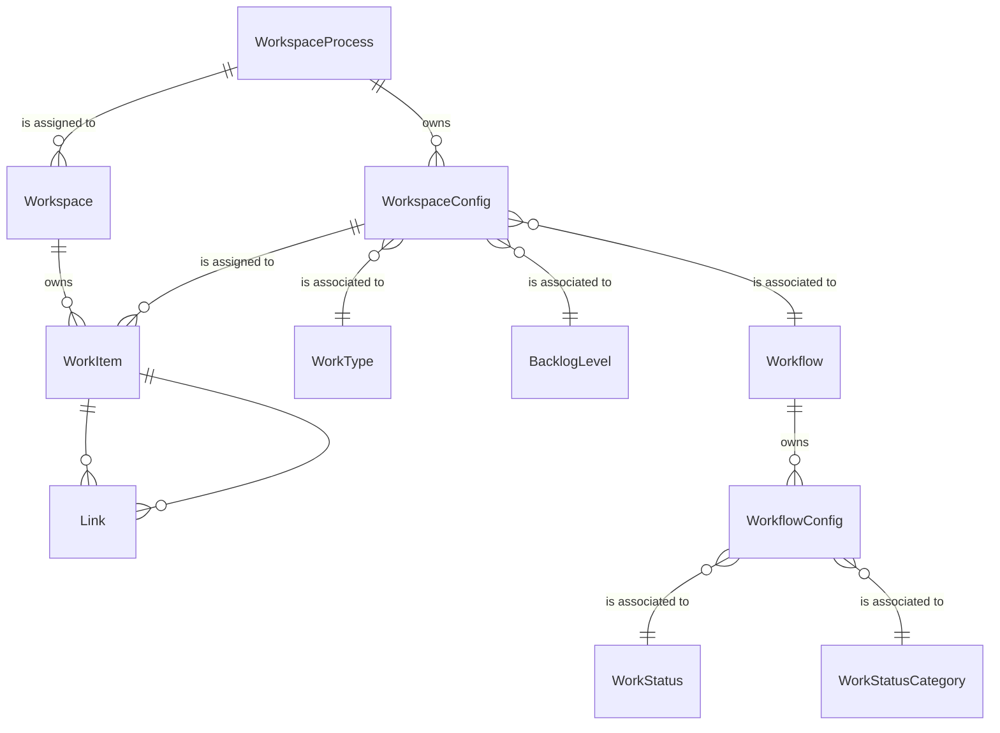

# Work Domain

# Models
- [Workspace](#workspace)
- [Work Item](#work-item)
- [Workspace Process](#workspace-process)
- [Workspace Config](#workspace-config)
- [Work Type](#work-type)
- [Backlog Level](#backlog-level)
- [Workflow](#workflow)
- [Workflow Config](#workflow-config)
- [Work Status](#work-status)
- [Work Status Category](#work-status-category)

## Workspace
A workspace is a container for work items. 

A workspace is either owned by Moda or managed by an external application and synchronized with Moda.

## Work Item
A work item represents a piece of work that needs to be completed.

## Workspace Process
The workspace process defines a set of workspace configurations that can be used within a work space.  A workspace process can be used in many workspaces.

### Business Rules
- A workspace process requires at least one work type to be configured.
- A work type can only be defined once within a workspace process.

## Workspace Config
The workspace config links work types with workflows and defines the backlog level for each to the workspace process.

## Work Type
Represents the type of work item.  Examples:
- Story
- Bug
- Feature
- Epic

## Backlog Level
Allows the work types to be defined in a hierarchy that is normalized across the organization.

## Workflow
A workflow is a set of work statuses that define the different stages a work item must go through to be considered done.

Future - need to define transitions and rules for owned workspaces.

### Business Rules
- A workflow requires at least three work statuses be configured.
- Each of the work status categories must be represented in a workflow for it to be valid.
- A work status can only be defined once within a workflow.
- The order of work status categories within the workflow config must be grouped.  To Do items are always at the beginning of the workflow and Done items are always at the end.
  - Valid Example (Order, Work Status, Work Status Category)
    - 1, New, To Do
    - 2, In Progress, In Progress
    - 3, In Review, In Progress
    - 4, Completed, Done
  - Invalid Example (Order, Work Status, Work Status Category)
    - 1, New, To Do
    - 2, In Progress, In Progress   <-- An In Progress work status category can not be configured in between configs with To Do work status categories
    - 3, Ready, To Do
    - 4, Completed, Done

## Workflow Config
The workflow config links work statuses, work status categories, and the order to the workflow.

## Work Status
The name of the stage within the workflow.  Each work status can be used in many workflows.

## Work Status Category
The work status category is an enum that helps sort and normalize work statuses across workflows.  The order and available values are:
1. To Do - Execution of the work item has not started.  This is also useful for workflows that have additional work statuses used to collect requirements, but don't want to consider those as started or in progress.
2. In Progress - The work or execution has started.
3. Done - The work or execution has been completed or cancelled.

# ERD
