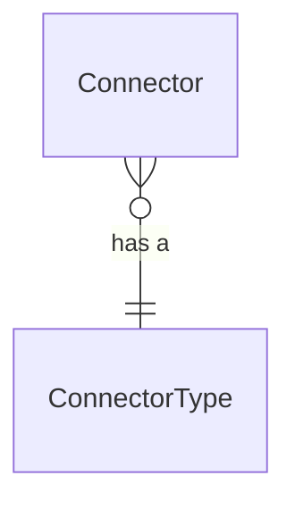

# App Integration
The app integratin domain enables the ability to define and manage integrations with external applications.

# Models
- [Connector](#connector)
- [Connector Type](#connector-type)

## Connector
A connector represents an integration with an external application.  This includes information needed to establish a connection like authentication and endoint configuration data.

## Connector Type
The connector type is an enum that represents the type of connector.  Current options:
- Azure DevOps

Multiple connectors for the same type can be configured.  This is expected when an organization has multiple instances or requires different authentication to connect for different data.

# ERD

# Architecture
The following diagram shows the high-level architecture:

# Available Connectors
- [Azure DevOps Boards](#azure-devops-boards)

## Azure DevOps Boards
The Azure DevOps Boards connector enables Moda to connect and retrieve data for the areas below and sychronize the it.  This sychronization is one-way.
- Projects
- Areas
- Iterations
- Work Items
- Work Item Types

### Configuration
The information required to configure the connector is:
- Organization - this is the Azure DevOps Organization name.
- PersonalAccessToken - this is the token that enables Moda to connect into an instance of Azure DevOps and read work item data.
  - The required access for the token within Azure DevOps is
    | Scope | Access |
    |--|--|
    | Work Items | Read |

A tenant may have multiple Azure DevOps Boards connectors, but each connector must have a unique Organization.  Put differently, each Azure DevOps Organization can only be linked by one connector.