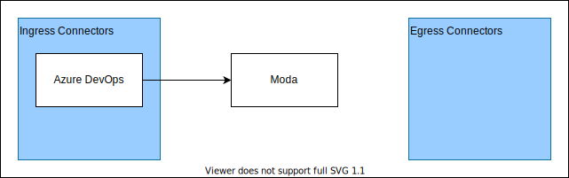

# App Integration
The app integratin domain enables the ability to define and manage integrations with external applications.

# Models
- [Connector](#connector)
- [Connector Type](#connector-type)

## Connector
A connector represents an integration with an external application.  This includes information needed to establish a connection like authentication and endoint configuration data.

## Connector Type
The connector type is an enum that represents the type of connector.  Current options:
- Azure DevOps

Multiple connectors for the same type can be configured.  This is expected when an organization has multiple instances or requires different authentication to connect for different data.

# ERD

# Architecture
The following diagram shows the high-level architecture:

