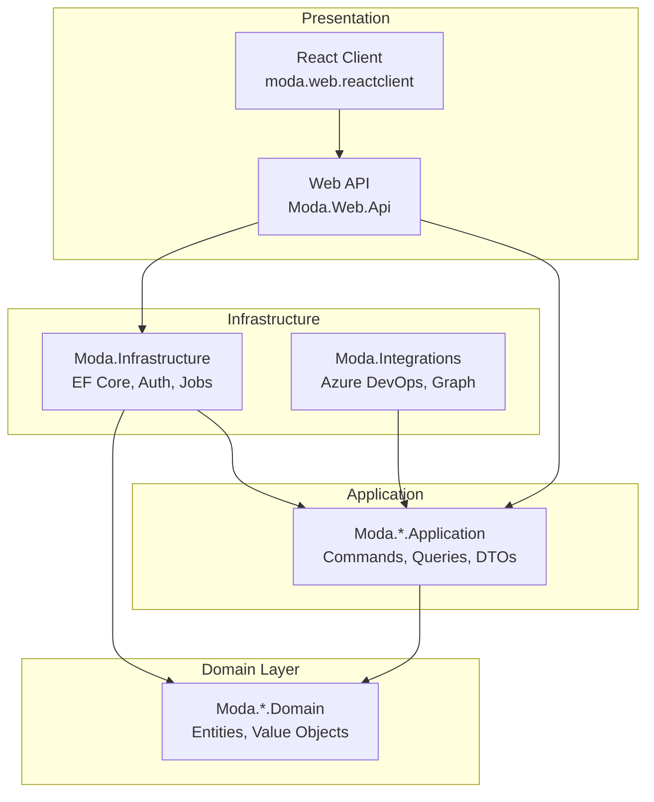

# Architecture

Moda follows **Clean Architecture** with **Domain-Driven Design (DDD)** principles, organized as a **modular monolith** with a shared database.

## Clean Architecture Layers



### Dependency Rules

- **Domain** (innermost) - Zero external dependencies. Contains entities, value objects, domain events, and interfaces.
- **Application** - Depends on Domain only. Contains commands, queries, handlers, DTOs, and validators.
- **Infrastructure** - Depends on Application and Domain. Contains EF Core, authentication, background jobs, and external integrations.
- **Web API** - Depends on all layers. Thin controllers that delegate to MediatR handlers.

These rules are enforced by automated architecture tests in `Moda.ArchitectureTests`.

## Solution Structure

```
Moda/
  Moda.Common/           # Shared libraries and base abstractions
    Moda.Common          # Utilities, extensions, helpers
    Moda.Common.Domain   # Base entities, value objects, interfaces
    Moda.Common.Application  # Base behaviors, validators, interfaces
    Moda.Tests.Shared    # Shared test utilities and fakers

  Moda.Services/         # Vertical slice domain services
    Moda.Work/           # Work item management
    Moda.Organization/   # Teams and employees
    Moda.Planning/       # Iterations and planning intervals
    Moda.Goals/          # Objectives and key results
    Moda.AppIntegration/ # Integration configuration
    Moda.Links/          # Cross-entity relationships
    Moda.Health/         # Health checks
    Moda.StrategicManagement/   # Strategic planning
    Moda.ProjectPortfolioManagement/  # Project portfolios

  Moda.Infrastructure/   # Cross-cutting concerns
  Moda.Integrations/     # External system integrations
  Moda.Web/              # Presentation layer
```

## Key Patterns

### CQRS with MediatR

All business operations are modeled as commands (writes) or queries (reads), dispatched through MediatR. Controllers are thin and contain no business logic.

```csharp
// Command
public sealed record CreateWorkItemCommand(string Title, Guid WorkspaceId) : ICommand<Guid>;

// Query
public sealed record GetWorkItemQuery(Guid Id) : IQuery<WorkItemDto>;
```

### Result Pattern

Handlers return `Result<T>` from CSharpFunctionalExtensions instead of throwing exceptions:

```csharp
public async Task<Result<Guid>> Handle(CreateWorkItemCommand request, CancellationToken ct)
{
    var workspace = await _context.Workspaces.FindAsync(request.WorkspaceId);
    if (workspace is null)
        return Result.Failure<Guid>("Workspace not found.");

    var workItem = workspace.CreateWorkItem(request.Title);
    return Result.Success(workItem.Id);
}
```

### No Repository Pattern

Application handlers use EF Core `DbContext` directly for data access. There is no repository abstraction layer.

### Vertical Slices

Each service follows consistent Domain/Application layering:

```
Moda.Services/Moda.{ServiceName}/
  src/
    Moda.{ServiceName}.Domain/        # Entities, value objects, interfaces
    Moda.{ServiceName}.Application/   # Commands, queries, DTOs, validators
  tests/
    Moda.{ServiceName}.Domain.Tests/
    Moda.{ServiceName}.Application.Tests/
```

### Feature Folders

Application layer is organized by aggregate root/feature:

```
Moda.Work.Application/
  WorkItems/
    Commands/
      CreateWorkItemCommand.cs
      CreateWorkItemCommandValidator.cs
    Queries/
      GetWorkItemQuery.cs
    Dtos/
      WorkItemDto.cs
```
