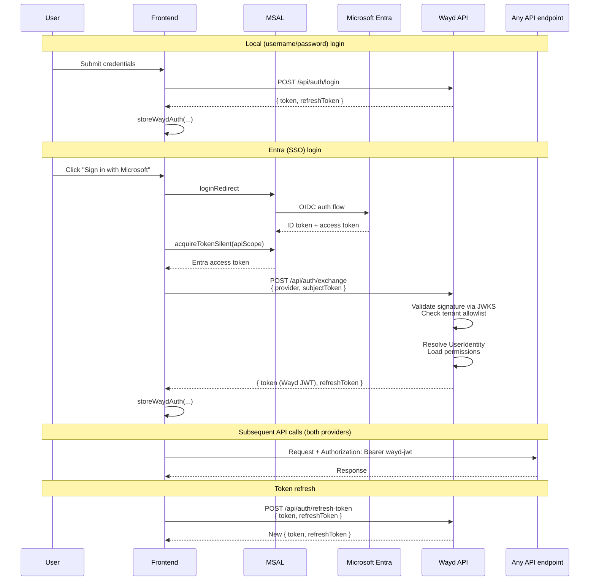
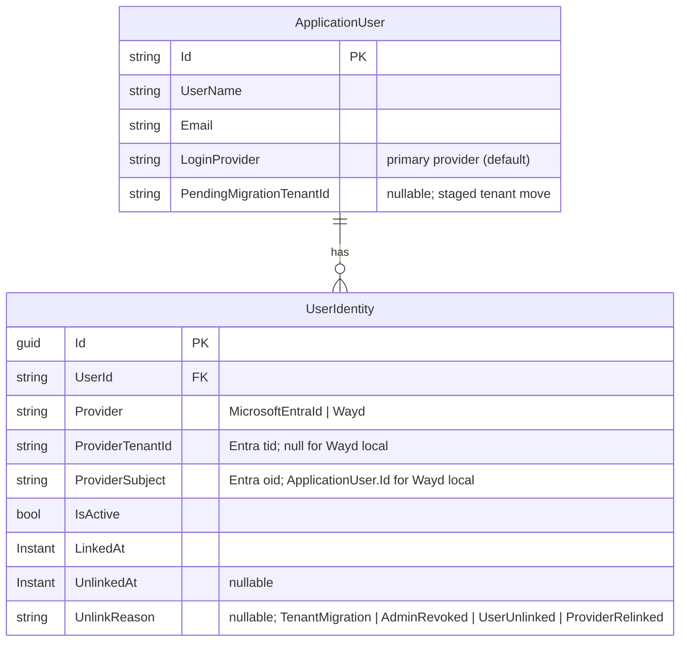

# Configuration

## Database

Database connection strings are configured in:

```
Wayd.Web/src/Wayd.Web.Api/Configurations/database.json
```

## Authentication

Wayd supports two authentication providers:

### Microsoft Entra ID (Azure AD)

:::tip Setting up a new environment
If you don't yet have an Entra app registration for this deployment, follow [Entra App Registration Setup](./entra-app-registration.mdx) first. That walks through creating the two app registrations (API + client), choosing the right token version, and collecting the GUIDs referenced below.
:::

**Frontend (MSAL)** — create a `.env` file in the repository root:

```env
AAD_CLIENT_ID='{your AAD client ID}'
AAD_TENANT_ID='{your AAD tenant ID}'
AAD_LOGON_AUTHORITY='https://login.microsoftonline.com/{your AAD tenant ID}'
API_SCOPE='{scope, usually api://{client ID}/access_as_user}'
API_BASE_URL='https://localhost:5001'
```

**Backend (token-exchange endpoint)** — configure in `Wayd.Web/src/Wayd.Web.Api/Configurations/security.json` or User Secrets. Only required when your deployment accepts Entra logins; local-only deployments leave `Enabled: false` and the other fields can be omitted.

```json
{
    "SecuritySettings": {
        "Providers": {
            "Entra": {
                "Enabled": true,
                "Authority": "https://login.microsoftonline.com/common/v2.0",
                "Audience": "{exact token aud claim — see note below}",
                "AllowedTenantIds": [ "{your AAD tenant ID}" ],
                "ClockSkewSeconds": 60
            }
        }
    }
}
```

| Key | Required when `Enabled: true` | Purpose |
| --- | --- | --- |
| `Enabled` | — | Gates `POST /api/auth/exchange`. Returns HTTP 503 when false. |
| `Authority` | yes | OIDC discovery URL. `/common/v2.0` is the multi-tenant endpoint. |
| `Audience` | yes | Must equal the token's `aud` claim exactly. See **Finding your Audience** below. |
| `AllowedTenantIds` | yes | Multi-tenant allowlist — tokens from other tenants are rejected even when Entra is enabled. Empty array fails startup. |
| `ClockSkewSeconds` | no | Defaults to 60. Tolerance for expiry/not-before checks. |

**Finding your Audience.** The `aud` claim shape depends on the token version your app registration issues:

- **v2.0 tokens** (`api.requestedAccessTokenVersion: 2` in the app manifest): `aud` is the bare `<ClientId>` GUID. This is what Wayd expects.
- **v1.0 tokens** (the default for older registrations, or when `api.requestedAccessTokenVersion` is `null`/`1`): `aud` is `api://<ClientId>` or `api://<ClientId>/access_as_user`.

Don't guess — decode a real token at [jwt.ms](https://jwt.ms) and copy the `aud` value verbatim. A mismatch here rejects every exchange attempt with a 401, which is hard to diagnose after the fact. If you're seeing `api://` in a token you expected to be v2-shaped, flip `api.requestedAccessTokenVersion: 2` per the [app registration guide](./entra-app-registration.mdx#set-the-token-version-to-v2).

Setting via User Secrets (preferred for local dev — `security.json` is committed with placeholders):

```bash
cd Wayd.Web/src/Wayd.Web.Api
dotnet user-secrets set "SecuritySettings:Providers:Entra:Enabled" "true"
dotnet user-secrets set "SecuritySettings:Providers:Entra:Audience" "{exact aud claim from a real token}"
dotnet user-secrets set "SecuritySettings:Providers:Entra:AllowedTenantIds:0" "{your AAD tenant ID}"
```

Array elements bind by index (`:0`, `:1`, ...). Add more tenants as you onboard them.

### Local Authentication

Configure in `Wayd.Web/src/Wayd.Web.Api/Configurations/security.json` or User Secrets:

```json
{
    "SecuritySettings": {
        "LocalJwt": {
            "Secret": "<strong-random-secret-at-least-32-chars>",
            "Issuer": "https://wayd.dev",
            "Audience": "https://api.wayd.dev",
            "TokenExpirationInMinutes": 60,
            "RefreshTokenExpirationInDays": 7
        }
    }
}
```

Only `Secret` needs to be set per deploy — the rest have sensible defaults and in particular `Issuer` / `Audience` are JWT claim identifiers, not environment-specific config. Don't override them per environment.

### Auth flow (high level)

Every login path produces a **Wayd JWT + Wayd refresh token** stored in `localStorage`/`sessionStorage`. The API only ever validates Wayd JWTs — MSAL tokens are exchanged for a Wayd JWT at login and never presented to the API directly.



Permissions travel as `permission` claims inside the Wayd JWT — no separate `/permissions` round-trip. An admin permission change takes effect on the user's next refresh (within the access-token TTL).

The login page consults `GET /api/auth/providers` to decide which provider buttons to show; a deployment with `SecuritySettings:Providers:Entra:Enabled = false` hides the Microsoft button entirely.

### Identity model

User → login-provider linkage lives in a `UserIdentity` table. One row per (user, provider-identity) pair, keyed by `(Provider, ProviderTenantId, ProviderSubject)`:



Every authentication path resolves a user through the same lookup, regardless of provider:

```csharp
var identity = db.UserIdentities.SingleOrDefault(i =>
    i.IsActive &&
    i.Provider == provider &&
    i.ProviderTenantId == tenantId &&
    i.ProviderSubject == subject);
```

Provider-specific logic is confined to *how the incoming credential is validated* (OIDC token vs. username/password), not how the user is resolved.

**Invariants:**

- Filtered unique index on `(Provider, ProviderTenantId, ProviderSubject) WHERE IsActive = 1`. NULL tenants are distinct under SQL Server's filtered-unique-index semantics, so local users (which have `ProviderTenantId = NULL`) coexist with Entra rows that haven't yet had their tenant populated.
- **At most one** active `UserIdentity` per `ApplicationUser` at rest. Every authenticable user has **exactly one**; pre-provisioned-but-not-yet-linked users (e.g., admin-created Entra users who haven't signed in via SSO yet) can have zero.
- This invariant is enforced in application code via `IUserIdentityStore.DeactivateAllActive`, not at the schema level. Any write path that adds a new active row must first deactivate any prior active rows, setting `UnlinkedAt` + an `UnlinkReason` (`ProviderRelinked` for relink, `TenantMigration` for the rebind below).
- Multi-provider account linking (one user, multiple active identities) is deliberately **not** supported. Relaxing the invariant later is a forward-compatible change; retrofitting it after multiple-active rows hit prod would not be.

**Local users in `UserIdentity`:** local (Wayd) users get a row with `Provider = "Wayd"`, `ProviderTenantId = NULL`, `ProviderSubject = ApplicationUser.Id.ToString()`. The stable `ApplicationUser.Id` is the subject — not the username, which is mutable. The local-login flow resolves by username first, verifies the password, and then asserts that an active `Wayd` identity row exists. That last check enables "disable local login for this specific user" by deactivating the identity row — no separate flag needed.

`ApplicationUser.LoginProvider` is retained as a "primary provider" indicator (it mirrors the active `UserIdentity.Provider`) so code that needs a cheap provider check doesn't have to join.

### Tenant migration rebind

When an org moves their users from one Entra tenant to another, an admin can pre-stage the migration per user via the [User Management UI](../user-guide/settings/index.mdx#tenant-migration). The rebind completes automatically when the user next signs in from the new tenant. The `ApplicationUser.Id` never changes, so all downstream FKs (permissions, work items, audit) are preserved.

During Entra token exchange, `UserService.ResolveUserByEntraIdentity` tries lookups in order: `FindActive(provider, tid, sub)` → null-tid upgrade (one-time tenant population for backfilled rows) → **pending-migration rebind** → fall through to create-new-user. The rebind path matches a user by `PendingMigrationTenantId == token.tid` AND `LoginProvider == MicrosoftEntraId` AND (`NormalizedUserName == token.upn` OR `NormalizedEmail == token.upn`). On match, inside one transaction:

1. Deactivate all active identity rows for the user (`UnlinkReason = TenantMigration`).
2. Insert a new active row with `(MicrosoftEntraId, token.tid, token.sub)`.
3. Clear `PendingMigrationTenantId`.

Re-staging an already-pending migration silently overwrites the previous target — last-write-wins on the flag. Cancellation (clearing the flag) is idempotent.

If staging is skipped and the user signs in from the new tenant first, the exchange creates a brand-new `ApplicationUser` with a separate `UserId` and FKs — there is no admin "merge users" UI to recover from this; it requires manual DB work. Cross-provider migration (e.g., Entra → Auth0) is not supported.

## Environment Variables

| Variable                                | Purpose                                       |
| --------------------------------------- | --------------------------------------------- |
| `OTEL_EXPORTER_OTLP_ENDPOINT`           | OpenTelemetry collector endpoint              |
| `APPLICATIONINSIGHTS_CONNECTION_STRING` | Azure Application Insights                    |
| `ASPNETCORE_ENVIRONMENT`                | Runtime environment (Development, Production) |
