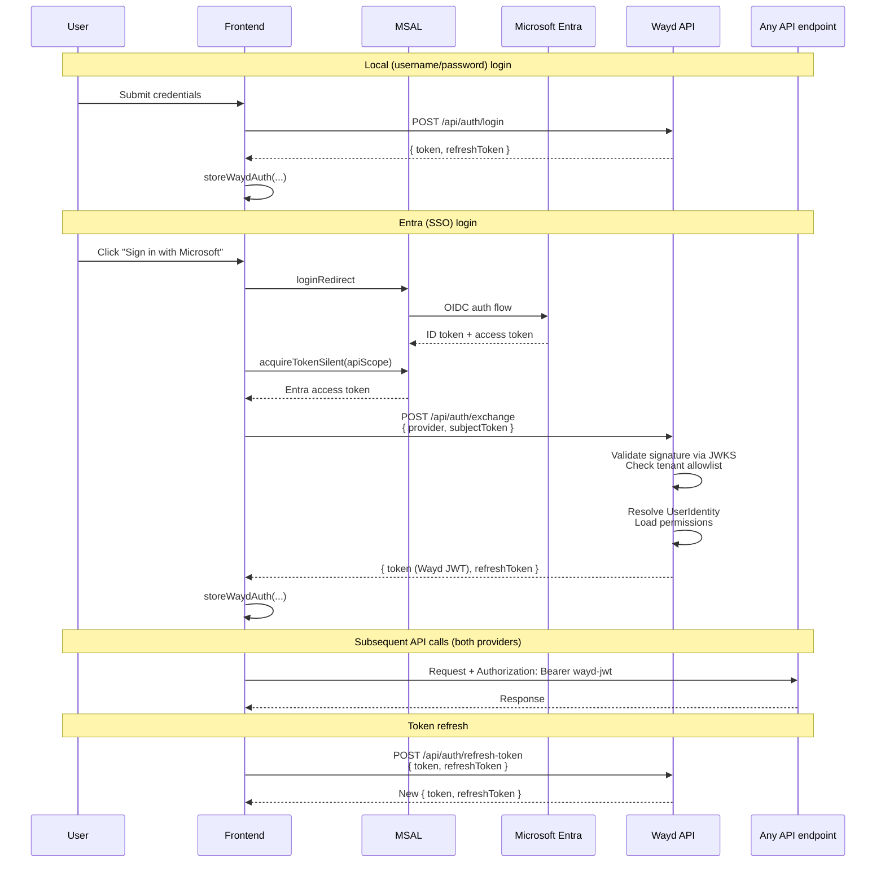

# Configuration

## Database

Database connection strings are configured in:

```
Wayd.Web/src/Wayd.Web.Api/Configurations/database.json
```

## Authentication

Wayd supports two authentication providers:

:::info Ongoing refactor
The identity model that links users to their login providers is being generalized to support multiple OIDC providers, multi-tenant Entra, tenant migrations, and a future token-exchange flow. See [Identity Model Refactor](./specs/identity-model-refactor.mdx) for the multi-PR spec.
:::

### Microsoft Entra ID (Azure AD)

**Frontend (MSAL)** — create a `.env` file in the repository root:

```env
AAD_CLIENT_ID='{your AAD client ID}'
AAD_TENANT_ID='{your AAD tenant ID}'
AAD_LOGON_AUTHORITY='https://login.microsoftonline.com/{your AAD tenant ID}'
API_SCOPE='{scope, usually api://{client ID}/access_as_user}'
API_BASE_URL='https://localhost:5001'
```

**Backend (token-exchange endpoint)** — configure in `Wayd.Web/src/Wayd.Web.Api/Configurations/security.json` or User Secrets. Only required when your deployment accepts Entra logins; local-only deployments leave `Enabled: false` and the other fields can be omitted.

```json
{
    "SecuritySettings": {
        "Providers": {
            "Entra": {
                "Enabled": true,
                "Authority": "https://login.microsoftonline.com/common/v2.0",
                "Audience": "{exact token aud claim — see note below}",
                "AllowedTenantIds": [ "{your AAD tenant ID}" ],
                "ClockSkewSeconds": 60
            }
        }
    }
}
```

| Key | Required when `Enabled: true` | Purpose |
| --- | --- | --- |
| `Enabled` | — | Gates `POST /api/auth/exchange`. Returns HTTP 503 when false. |
| `Authority` | yes | OIDC discovery URL. `/common/v2.0` is the multi-tenant endpoint. |
| `Audience` | yes | Must equal the token's `aud` claim exactly. See **Finding your Audience** below. |
| `AllowedTenantIds` | yes | Multi-tenant allowlist — tokens from other tenants are rejected even when Entra is enabled. Empty array fails startup. |
| `ClockSkewSeconds` | no | Defaults to 60. Tolerance for expiry/not-before checks. |

**Finding your Audience.** The `aud` claim shape depends on the token version your app registration issues:

- **v2.0 tokens** (`accessTokenAcceptedVersion: 2` in the app manifest): `aud` is typically just the `<ClientId>` GUID.
- **v1.0 tokens** (the default for many older registrations): `aud` is typically `api://<ClientId>` or `api://<ClientId>/access_as_user`.

Don't guess — decode a real token at [jwt.ms](https://jwt.ms) and copy the `aud` value verbatim. A mismatch here rejects every exchange attempt with a 401, which is hard to diagnose after the fact.

Setting via User Secrets (preferred for local dev — `security.json` is committed with placeholders):

```bash
cd Wayd.Web/src/Wayd.Web.Api
dotnet user-secrets set "SecuritySettings:Providers:Entra:Enabled" "true"
dotnet user-secrets set "SecuritySettings:Providers:Entra:Audience" "{exact aud claim from a real token}"
dotnet user-secrets set "SecuritySettings:Providers:Entra:AllowedTenantIds:0" "{your AAD tenant ID}"
```

Array elements bind by index (`:0`, `:1`, ...). Add more tenants as you onboard them.

### Local Authentication

Configure in `Wayd.Web/src/Wayd.Web.Api/Configurations/security.json` or User Secrets:

```json
{
    "SecuritySettings": {
        "LocalJwt": {
            "Secret": "<strong-random-secret-at-least-32-chars>",
            "Issuer": "https://wayd.dev",
            "Audience": "https://api.wayd.dev",
            "TokenExpirationInMinutes": 60,
            "RefreshTokenExpirationInDays": 7
        }
    }
}
```

Only `Secret` needs to be set per deploy — the rest have sensible defaults and in particular `Issuer` / `Audience` are JWT claim identifiers, not environment-specific config. Don't override them per environment.

### Auth flow (high level)

Every login path produces a **Wayd JWT + Wayd refresh token** stored in `localStorage`/`sessionStorage`. The API only ever validates Wayd JWTs — MSAL tokens are exchanged for a Wayd JWT at login and never presented to the API directly.



Permissions travel as `permission` claims inside the Wayd JWT — no separate `/permissions` round-trip. An admin permission change takes effect on the user's next refresh (within the access-token TTL).

The login page consults `GET /api/auth/providers` to decide which provider buttons to show; a deployment with `SecuritySettings:Providers:Entra:Enabled = false` hides the Microsoft button entirely.

See [Identity Model Refactor](./specs/identity-model-refactor.mdx) for the full design rationale.

## Environment Variables

| Variable                                | Purpose                                       |
| --------------------------------------- | --------------------------------------------- |
| `OTEL_EXPORTER_OTLP_ENDPOINT`           | OpenTelemetry collector endpoint              |
| `APPLICATIONINSIGHTS_CONNECTION_STRING` | Azure Application Insights                    |
| `ASPNETCORE_ENVIRONMENT`                | Runtime environment (Development, Production) |
