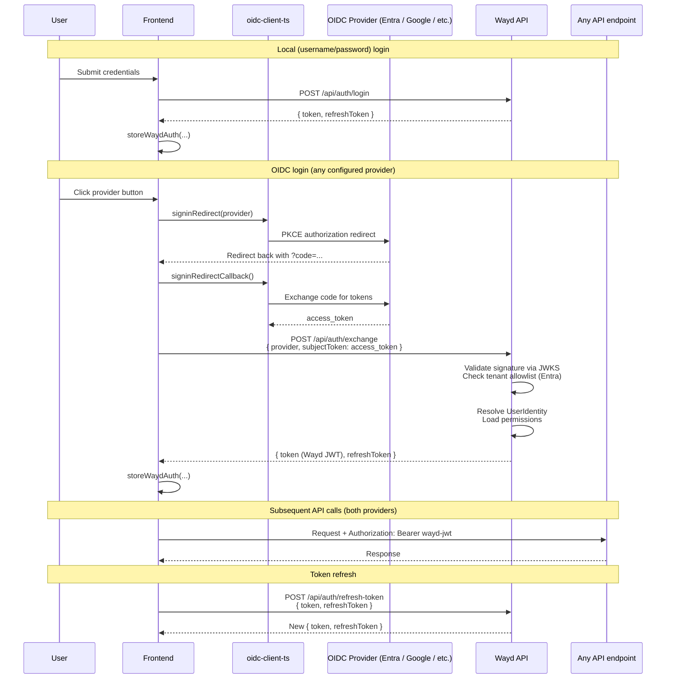
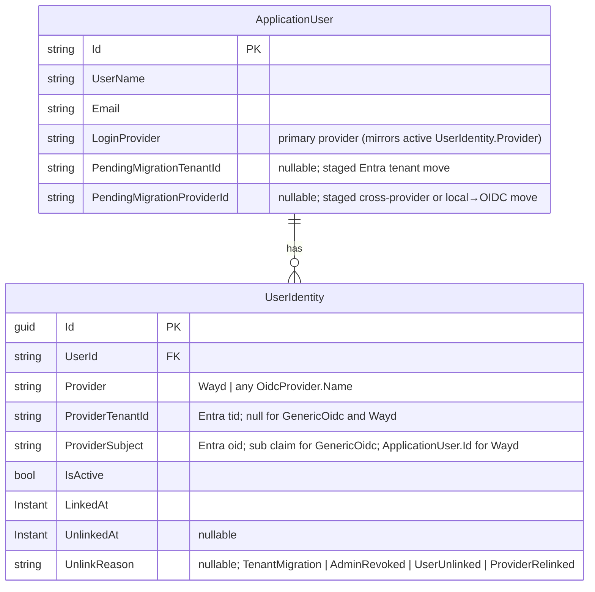

# Configuration

## Database

Database connection strings are configured in:

```
Wayd.Web/src/Wayd.Web.Api/Configurations/database.json
```

## Authentication

Wayd supports two authentication paths:

- **Local (username + password)** — always available, configured per-deployment via JWT signing settings.
- **Identity providers (OIDC)** — Microsoft Entra ID and any standards-compliant OIDC provider (Google, Okta, Auth0, Keycloak, …). Providers are stored in the database and managed by admins through the Settings UI; no app restart is needed to add, edit, enable, or disable one.

### Identity providers (DB-managed)

Each row in the `Identity.OidcProviders` table is one configured provider — its discovery `Authority`, public `ClientId`, expected token `Audience`, scopes, and (for Entra) the allowed-tenant list. The token-exchange endpoint resolves provider metadata from this table on every request, with a short cache TTL and explicit invalidation on admin writes.

**Bootstrap (existing deployments).** On first start after upgrading, if `SecuritySettings:Providers:Entra:Enabled = true` and no `OidcProvider` row exists for Microsoft Entra ID yet, the application seeds one from `SecuritySettings:Providers:Entra`. After that seed, the database is the source of truth — config-file edits no longer flow through, so admins should make subsequent changes via the Settings UI.

**Managing providers.** Once the `IdentityProviders` feature flag is enabled, admins with the `Permissions.OidcProviders.{View|Create|Update|Delete}` permissions can manage providers from **Settings → Identity Providers**. The "Test connection" button fetches the provider's `.well-known/openid-configuration` document so typos in `Authority` are caught at configuration time, not at the user's next login.

| Provider field | Purpose |
| --- | --- |
| `Name` | Stable key written into `UserIdentity.Provider`. Immutable post-create. Reserved value `"Wayd"` (local accounts). |
| `DisplayName` | Human-readable label rendered on the login page. |
| `ProviderType` | `MicrosoftEntraId` (multi-tenant via `/common/`, tenant allowlist) or `GenericOidc` (single-issuer, no tenant check). Immutable post-create. |
| `Authority` | OIDC issuer URL. Must be `https`. Wayd appends `/.well-known/openid-configuration` for discovery. |
| `ClientId` | Public OAuth client ID. Surfaced to the frontend so the OIDC client can be constructed. |
| `Audience` | Pinned `aud` claim on incoming tokens. See **Finding your Audience** below. |
| `Scopes` | OAuth scopes the frontend requests when initiating sign-in. |
| `AllowedTenantIds` | **Entra only.** Empty/null rejected at the entity level. Tokens whose `tid` (or issuer-derived tenant) is not in this list are rejected. Ignored for `GenericOidc`. |
| `ClockSkewSeconds` | Tolerance for expiry/not-before checks. Defaults to 60; range `[0, 600]`. |
| `IsEnabled` | Disabled providers are hidden from the login page; exchange attempts against them return 401. |

**First-boot seed config.** Configure in `Wayd.Web/src/Wayd.Web.Api/Configurations/security.json` or User Secrets on any deployment that doesn't yet have an `OidcProviders` row. Once seeded, this config block is no longer consulted at runtime.

```json
{
    "SecuritySettings": {
        "Providers": {
            "Entra": {
                "Enabled": true,
                "Authority": "https://login.microsoftonline.com/{your-tenant-id}/v2.0",
                "SpaClientId": "{client app registration client ID}",
                "ApiScope": "api://{api-client-id}/access_as_user",
                "Audience": "{API app registration client ID — bare GUID for v2 tokens}",
                "AllowedTenantIds": [ "{your Entra tenant ID}" ],
                "ClockSkewSeconds": 60
            }
        }
    }
}
```

The seeder reads all fields from `Providers:Entra`:

- `SpaClientId` — the **client (SPA) app registration's** client ID, presented to Entra when initiating sign-in
- `ApiScope` — the API scope (e.g. `api://{api-client-id}/access_as_user`) appended to the standard OIDC scopes so Entra issues an access token with `aud = {api-client-id}`
- `Audience` — the **API app registration's** client ID, pinned as the expected `aud` claim on incoming tokens
- `Authority` — use the tenant-specific URL (`/v2.0` suffix required) for single-tenant deployments; use `https://login.microsoftonline.com/common/v2.0` only for true multi-tenant deployments where users from multiple Entra tenants sign in

These are different values because Wayd follows Entra's standard two-registration pattern (see [Entra App Registration Setup](./entra-app-registration.mdx)).

If `SpaClientId` is not set the seed is skipped with a logged warning; the operator can create the row manually via the Settings UI instead.

:::tip Setting up a new environment
If you don't yet have an Entra app registration for this deployment, follow [Entra App Registration Setup](./entra-app-registration.mdx) first. That walks through creating the two app registrations (API + client), choosing the right token version, and collecting the GUIDs referenced above.
:::

**Finding your Audience.** Whether you're seeding a new deployment via config or editing the row in the Settings UI, the `aud` claim shape depends on the token version your app registration issues:

- **v2.0 tokens** (`api.requestedAccessTokenVersion: 2` in the app manifest): `aud` is the bare `<ClientId>` GUID. This is what Wayd expects.
- **v1.0 tokens** (the default for older registrations, or when `api.requestedAccessTokenVersion` is `null`/`1`): `aud` is `api://<ClientId>` or `api://<ClientId>/access_as_user`.

Don't guess — decode a real token at [jwt.ms](https://jwt.ms) and copy the `aud` value verbatim. A mismatch here rejects every exchange attempt with a 401, which is hard to diagnose after the fact. If you're seeing `api://` in a token you expected to be v2-shaped, flip `api.requestedAccessTokenVersion: 2` per the [app registration guide](./entra-app-registration.mdx#set-the-token-version-to-v2).

Setting the seed config via User Secrets (preferred for local dev — `security.json` is committed with placeholders):

```bash
cd Wayd.Web/src/Wayd.Web.Api
dotnet user-secrets set "SecuritySettings:Providers:Entra:Enabled" "true"
dotnet user-secrets set "SecuritySettings:Providers:Entra:Authority" "https://login.microsoftonline.com/{your-tenant-id}/v2.0"
dotnet user-secrets set "SecuritySettings:Providers:Entra:SpaClientId" "{client app registration client ID}"
dotnet user-secrets set "SecuritySettings:Providers:Entra:ApiScope" "api://{api-client-id}/access_as_user"
dotnet user-secrets set "SecuritySettings:Providers:Entra:Audience" "{API app registration client ID}"
dotnet user-secrets set "SecuritySettings:Providers:Entra:AllowedTenantIds:0" "{your Entra tenant ID}"
```

Array elements bind by index (`:0`, `:1`, ...). The seeder picks these up on the next application start. Subsequent changes go through the Settings UI.

### Local Authentication

Configure in `Wayd.Web/src/Wayd.Web.Api/Configurations/security.json` or User Secrets:

```json
{
    "SecuritySettings": {
        "LocalJwt": {
            "Secret": "<strong-random-secret-at-least-32-chars>",
            "Issuer": "https://wayd.dev",
            "Audience": "https://api.wayd.dev",
            "TokenExpirationInMinutes": 60,
            "RefreshTokenExpirationInDays": 7
        }
    }
}
```

Only `Secret` needs to be set per deploy — the rest have sensible defaults and in particular `Issuer` / `Audience` are JWT claim identifiers, not environment-specific config. Don't override them per environment.

### Auth flow (high level)

Every login path produces a **Wayd JWT + Wayd refresh token** stored in `localStorage`/`sessionStorage`. The API only ever validates Wayd JWTs — OIDC tokens from upstream providers are exchanged for a Wayd JWT at login and never presented to the API directly.



Permissions travel as `permission` claims inside the Wayd JWT — no separate `/permissions` round-trip. An admin permission change takes effect on the user's next refresh (within the access-token TTL).

The login page consults `GET /api/auth/providers` (anonymous, cheap) to decide which provider buttons to render. The response is:

```json
{
  "local": true,
  "oidc": [
    {
      "name": "MicrosoftEntraId",
      "displayName": "Microsoft Entra ID",
      "providerType": "MicrosoftEntraId",
      "authority": "https://login.microsoftonline.com/common/v2.0",
      "clientId": "{public client ID}",
      "scopes": ["openid", "profile", "email"]
    }
  ]
}
```

Only enabled providers appear. `AllowedTenantIds` and any future server-side secrets are deliberately not exposed — they're security gates, not client config.

### Identity model

User → login-provider linkage lives in a `UserIdentity` table. One row per (user, provider-identity) pair, keyed by `(Provider, ProviderTenantId, ProviderSubject)`:



Every authentication path resolves a user through the same lookup, regardless of provider:

```csharp
var identity = db.UserIdentities.SingleOrDefault(i =>
    i.IsActive &&
    i.Provider == provider &&
    i.ProviderTenantId == tenantId &&
    i.ProviderSubject == subject);
```

Provider-specific logic is confined to *how the incoming credential is validated* (OIDC token vs. username/password) and *what's used as the subject*, not how the row is resolved. For Microsoft Entra ID the subject is `oid` and the tenant is `tid`; for `GenericOidc` providers the subject is `sub` and `ProviderTenantId` is `null` (single-issuer providers have no tenant concept); for local users the subject is `ApplicationUser.Id` and `ProviderTenantId` is `null`.

**Invariants:**

- Filtered unique index on `(Provider, ProviderTenantId, ProviderSubject) WHERE IsActive = 1`. NULL tenants are distinct under SQL Server's filtered-unique-index semantics, so local users (which have `ProviderTenantId = NULL`) coexist with Entra rows that haven't yet had their tenant populated.
- **At most one** active `UserIdentity` per `ApplicationUser` at rest. Every authenticable user has **exactly one**; pre-provisioned-but-not-yet-linked users (e.g., admin-created Entra users who haven't signed in via SSO yet) can have zero.
- This invariant is enforced in application code via `IUserIdentityStore.DeactivateAllActive`, not at the schema level. Any write path that adds a new active row must first deactivate any prior active rows, setting `UnlinkedAt` + an `UnlinkReason`.
- Multi-provider account linking (one user, multiple active identities) is deliberately **not** supported. Relaxing the invariant later is a forward-compatible change; retrofitting it after multiple-active rows hit prod would not be.

**Local users in `UserIdentity`:** local (Wayd) users get a row with `Provider = "Wayd"`, `ProviderTenantId = NULL`, `ProviderSubject = ApplicationUser.Id.ToString()`. The stable `ApplicationUser.Id` is the subject — not the username, which is mutable. The local-login flow resolves by username first, verifies the password, and then asserts that an active `Wayd` identity row exists. That last check enables "disable local login for this specific user" by deactivating the identity row — no separate flag needed.

`ApplicationUser.LoginProvider` is retained as a "primary provider" indicator (it mirrors the active `UserIdentity.Provider`) so code that needs a cheap provider check doesn't have to join.

### Identity migration

Wayd supports three admin-initiated identity migration workflows. In all three cases the `ApplicationUser.Id` is preserved, so all downstream FKs (permissions, work items, audit) remain intact.

#### Entra tenant migration

When an org moves users from one Entra tenant to another, an admin stages the migration per user. The rebind completes automatically when the user next signs in from the new tenant.

`PendingMigrationTenantId` is set on `ApplicationUser` to the target Entra tenant GUID. During Entra token exchange, `UserService.ResolveUserByEntraIdentity` tries lookups in order: `FindActive(provider, tid, sub)` → null-tid upgrade (one-time tenant population for backfilled rows) → **pending-migration rebind** → fall through to create-new-user. The rebind path matches a user by `PendingMigrationTenantId == token.tid` AND `LoginProvider == MicrosoftEntraId` AND (`NormalizedUserName == token.upn` OR `NormalizedEmail == token.upn`). On match, inside one transaction:

1. Deactivate all active identity rows (`UnlinkReason = TenantMigration`).
2. Insert a new active row with `(MicrosoftEntraId, token.tid, token.sub)`.
3. Clear `PendingMigrationTenantId`.

If staging is skipped and the user signs in from the new tenant first, the exchange creates a brand-new `ApplicationUser` with a separate `UserId` — there is no admin "merge users" UI to recover from this; it requires manual DB work.

#### Cross-provider migration (OIDC→OIDC or Wayd→OIDC)

An admin can move a user from one OIDC provider to another, or from a local (Wayd) account to an OIDC provider. As with tenant migration, the rebind is deferred — the user's current login continues to work until they sign in via the target provider.

`PendingMigrationProviderId` is set on `ApplicationUser` to the target provider's `Name`. During token exchange for a GenericOidc provider, `UserService.ResolveFromGenericOidcPrincipalAsync` checks for a pending provider migration after the normal identity lookup fails. The rebind matches a user by `PendingMigrationProviderId == providerName` AND `NormalizedEmail == token.email` (rejected if `email_verified=false`). On match, inside one transaction:

1. Deactivate all active identity rows (`UnlinkReason = ProviderRelinked`).
2. Insert a new active row with `(providerName, null, token.sub)`.
3. Update `LoginProvider` to the new provider and clear `PendingMigrationProviderId`.

If the migrating user was previously a local account (Wayd→OIDC), the `PasswordHash` is cleared after the transaction commits — the hash is already unreachable at login (the Wayd identity is deactivated), but removing it makes the intent explicit.

Re-staging an already-pending migration silently overwrites the previous target. Cancellation is idempotent. The action is available for any user whose current provider differs from the target; it is hidden when only one OIDC provider is configured.

#### OIDC→local conversion

An admin can convert an OIDC user to a local (password-based) account immediately — no deferred rebind, the change takes effect at once. This is the reverse of Wayd→OIDC and requires the admin to set a temporary password. The user is forced to change it on next login.

The operation runs entirely inside one transaction:

1. Deactivate all active identity rows (`UnlinkReason = ProviderRelinked`).
2. Insert a new active `Wayd` identity row.
3. Reset the password hash to the supplied temporary password.
4. Update `LoginProvider` to `"Wayd"` and set `MustChangePassword = true`.

Password policy is validated before the transaction opens — a bad password returns a clean failure without touching the database.

## Environment Variables

| Variable                                | Purpose                                       |
| --------------------------------------- | --------------------------------------------- |
| `OTEL_EXPORTER_OTLP_ENDPOINT`           | OpenTelemetry collector endpoint              |
| `APPLICATIONINSIGHTS_CONNECTION_STRING` | Azure Application Insights                    |
| `ASPNETCORE_ENVIRONMENT`                | Runtime environment (Development, Production) |
