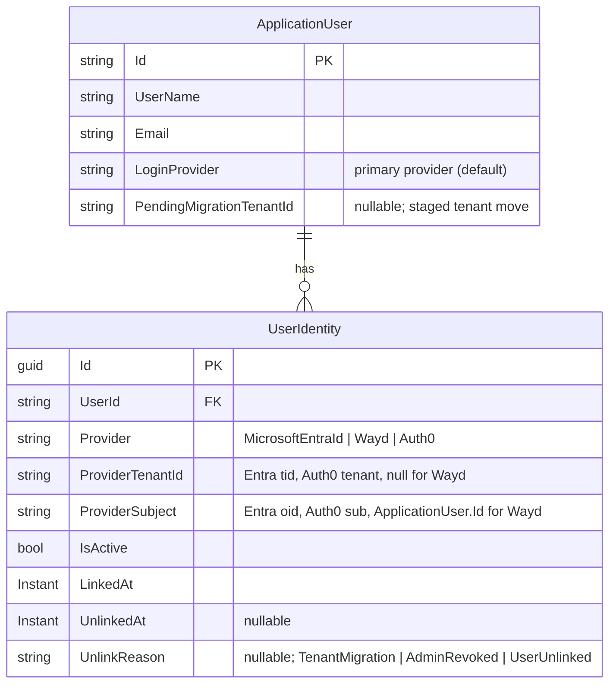
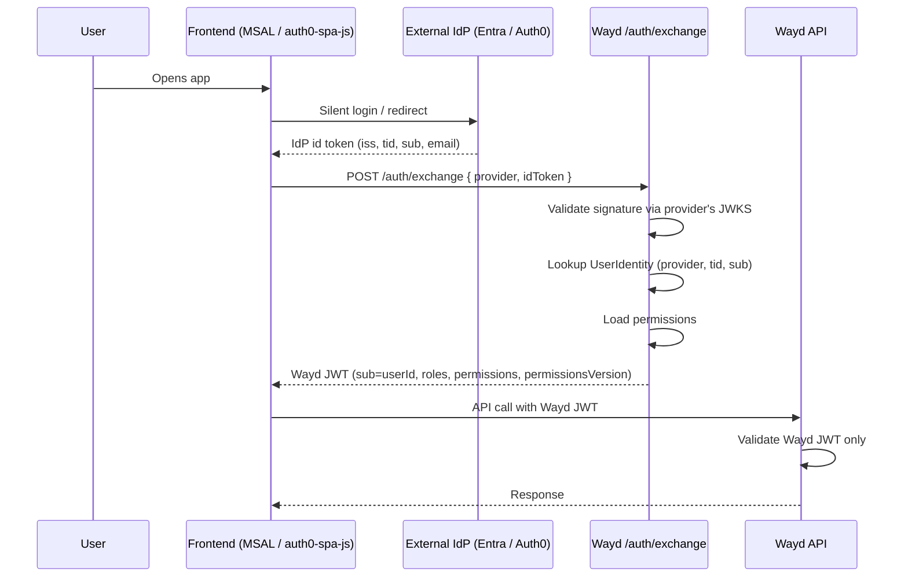

# Identity Model Refactor

This spec coordinates a multi-PR effort to generalize Wayd's identity model so it can support:

1. Multiple OIDC providers side-by-side (Microsoft Entra ID today, Auth0 soon).
2. Multi-tenant Entra logins where different orgs' tenants are onboarded independently.
3. History-preserving tenant migrations (e.g., an org moves their users from one Entra tenant to another).
4. A future token-exchange flow that mints a Wayd JWT carrying permission claims, eliminating the "Loading Permissions" wait on first load after inactivity.

The work is sequenced across several PRs so each is independently shippable and reversible.

## Background

### The pre-refactor model (motivation)

Before this spec's work began, identity linkage lived as flat columns on `ApplicationUser`:

- `ObjectId` — nullable string, populated from the Entra `oid` claim. Unused by the local (Wayd) provider.
- `LoginProvider` — `"MicrosoftEntraId"` or `"Wayd"`.

Lookups diverged by provider — the Entra path resolved users via `u.ObjectId == oid`, and the local path via `UserManager.FindByNameAsync(username)`. Those two call sites (in `UserService.CreateUpdate.cs` and `TokenService.cs` respectively) are the anchors PR 1 converts to the unified `UserIdentity` lookup.

### Why that shape didn't generalize

- No uniqueness guarantee per provider. `ObjectId` had no index; nothing prevented an Auth0 `sub` from colliding with an Entra `oid`.
- No tenant dimension. Multi-tenant Entra worked only by accident (Entra `oid`s are globally unique within Entra). A second OIDC provider would break that assumption.
- `ObjectId` is Entra's word. In an OIDC-generic world the field is the `sub` claim.
- A tenant migration (same human, new tenant → new `tid` + new `oid`) had no clean representation. Overwriting the flat columns loses audit history.

### What this spec introduces

A `UserIdentity` table — one row per (user, provider-identity) pair — with columns `(Provider, ProviderTenantId, ProviderSubject)`. Every authentication path resolves through the same lookup. History is preserved by marking old rows inactive rather than deleting them.

## Target model



### Invariants

- Unique filtered index: `(Provider, ProviderTenantId, ProviderSubject) WHERE IsActive = 1`. `NULL` tenant values are distinct under SQL Server's filtered unique index semantics.
- **At most one** active `UserIdentity` per `ApplicationUser` at rest. Every user whose account is authenticable has **exactly one**; the general rule allows zero for pre-provisioned-but-not-yet-linked cases (e.g., an admin-created Entra user who has not yet signed in via SSO).
- The invariant is enforced in application code — not at the schema level — via `IUserIdentityStore.DeactivateAllActive`. Any write path that adds a new active row for a user must first deactivate any prior active rows (setting `UnlinkedAt` + `UnlinkReason = ProviderRelinked` for the relink case, or `TenantMigration` for PR 4's rebind). A database-level check constraint (unique index on `UserId WHERE IsActive = 1`) is an option but has not been added in PR 1 — the store-level enforcement is load-bearing.
- This deliberately does **not** support multi-provider account linking (one user, multiple active identities). If that becomes a requirement, relaxing the invariant is a forward-compatible schema change; retrofitting the invariant once multiple-active rows exist in prod is much harder.
- Local users get a row with `Provider = "Wayd"`, `ProviderTenantId = NULL`, `ProviderSubject = ApplicationUser.Id.ToString()`. The stable Wayd user id is the subject — not the username, which is mutable.
- `ApplicationUser.LoginProvider` is retained as a "default/primary" indicator to avoid churn in code that reads it today. It mirrors the active `UserIdentity.Provider`.

### Unified lookup

```csharp
var identity = db.UserIdentities.SingleOrDefault(i =>
    i.IsActive &&
    i.Provider == provider &&
    i.ProviderTenantId == tenantId &&
    i.ProviderSubject == subject);
```

Every provider — Entra, Auth0, Wayd local — uses the same query. Provider-specific logic is confined to *how the incoming credential is validated* (OIDC token vs. username/password), not how the user is resolved.

## PR sequence

Four PRs, landing in order. Each is independently shippable and reversible.

### PR 1 — Introduce `UserIdentity` table + cutover (invisible)

**Goal:** replace the flat `ObjectId` column with a proper identity table. No behavior changes, no new features. If done right, no user notices.

**Scope:**

- New `UserIdentity` entity, EF config, fluent mapping.
- Filtered unique index on `(Provider, ProviderTenantId, ProviderSubject) WHERE IsActive = 1`.
- Migration:
  - Create `UserIdentity` table.
  - Backfill: one row per existing `ApplicationUser`:
    - Entra users (`LoginProvider = "MicrosoftEntraId"`, `ObjectId IS NOT NULL`) → `Provider = "MicrosoftEntraId"`, `ProviderSubject = ObjectId`, `ProviderTenantId = NULL`.
    - Local users (`LoginProvider = "Wayd"`) → `Provider = "Wayd"`, `ProviderSubject = ApplicationUser.Id`, `ProviderTenantId = NULL`.
  - Leave `ApplicationUser.ObjectId` in place (rollback safety net).
- Update lookup sites:
  - `UserService.CreateUpdate.cs:35` — query `UserIdentity` by `(Provider, ProviderTenantId, ProviderSubject)`.
  - `TokenService.cs:28` — resolve by username → `ApplicationUser`, then assert an active `Wayd` `UserIdentity` row exists. Deactivated row ⇒ deny login.
- **Null-`tid` upgrade path on Entra login:**
  - If no match on `(provider, tid, sub)`, fall back to `(provider, sub)` where `ProviderTenantId IS NULL`.
  - If exactly one row matches, write `tid` into it and proceed.
  - If more than one row matches (e.g., `oid` collision across tenants — astronomically unlikely but possible), bail out and log. Do **not** auto-link.
  - Use a transaction with appropriate locking to prevent concurrent-login races from racing each other through the upgrade.

**Out of scope for PR 1:**

- Dropping `ObjectId` from `ApplicationUser`. Keep one release as rollback safety.
- Removing `ApplicationUser.LoginProvider`.
- Any admin UI.
- Tenant migration rebind.
- Token exchange endpoint.

**Pre-deploy audit queries (must all return 0 before deploy):**

```sql
-- Any user with an ObjectId but wrong provider tag?
SELECT COUNT(*) FROM identity.Users
WHERE ObjectId IS NOT NULL AND LoginProvider <> 'MicrosoftEntraId';

-- Any Entra user missing their ObjectId?
SELECT COUNT(*) FROM identity.Users
WHERE LoginProvider = 'MicrosoftEntraId' AND ObjectId IS NULL;
```

**Post-migration assertion:** every `ApplicationUser` has exactly one active `UserIdentity`. Fail the deploy if not.

**Rollback plan:** revert code. Old `ObjectId`-based lookups work unchanged. `UserIdentity` table sits unused, which is harmless.

**Merge criteria:** logs show the null-`tid` upgrade path populating tenants on normal logins for at least a few days, across both providers. Zero duplicate-user creations. Zero login failures attributable to the new lookup.

### PR 2 — Drop `ObjectId` from `ApplicationUser`

Removes the now-unused `ObjectId` column and rewires the remaining callers that still referenced it. Safe to ship in the same release as PR 1, or in a follow-up release after a soak period — the code paths are independent.

**Scope:**

- Remove `ObjectId` property from `ApplicationUser` and the mapping in `ApplicationUserConfig` (`IdentityConfiguration.cs`).
- Migration `Drop-ApplicationUser-ObjectId`: drops the column; `Down` re-adds the column and rehydrates it from the active `MicrosoftEntraId` `UserIdentity` rows so rollback is non-destructive.
- Rewire the username/email-taken guards in `CreateOrUpdateFromPrincipalAsync` to check `IUserIdentityStore.ExistsActive(userId, MicrosoftEntraId)` instead of inspecting `ObjectId`.
- Remove the three `user.ObjectId = ...` writes in the principal-link path — the `UserIdentity` row is written by `EnsureEntraIdentityRowAsync` downstream.
- Rewire `UpdateMissingEmployeeIds` and `SyncUsersFromEmployeeRecords` (which correlated external employee records by matching `ObjectId` to `EmployeeNumber`) to use a new `IUserIdentityStore.GetActiveSubjectsByProvider(provider)` batch lookup. Pulls the Entra subject from the user's active identity row.

**Rollback:** revert the code. The migration's `Down` re-creates the column and re-populates it from `UserIdentity.ProviderSubject` for active Entra identities, so the old `ObjectId`-based lookups would work unchanged if PR 1 were also reverted.

### PR 3 — Token exchange + Wayd JWT with permission claims (multi-PR effort on its own)

This is the architectural shift that also fixes the 10-second "Loading Permissions" screen. It will likely span several PRs internally.

**Premise:** treat external IdP tokens (Entra, Auth0) as *identity assertions*, not API credentials. The API only ever validates Wayd JWTs.



**Provider registry (backend config):**

```
{ name, type: "entra" | "auth0" | "oidc-generic",
  issuer, audience, jwksUri, tenantId?, allowedDomains?, userMappingStrategy }
```

One config row per onboarded external tenant. Multi-tenant Entra = N rows, one per onboarded org's `tid`. Auth0 = N rows, one per Auth0 tenant.

**Exchange endpoint responsibilities:**

1. Validate the external token's signature via OIDC discovery / JWKS.
2. Validate audience and expiry; enforce a tenant allowlist (the multi-tenant guard).
3. Resolve the user via the existing `UserIdentity` lookup (same path as today's principal-based flow).
4. Load the user's flattened permission set.
5. Mint a Wayd JWT with permission claims embedded, plus a Wayd refresh token.
6. Return `{ token, refreshToken, tokenExpiresAt, mustChangePassword }` — same shape as the existing local-JWT `/auth/token` response.

**Sub-PRs:**

#### PR 3.1 — Backend exchange endpoint + login-page provider gating

Delivers the Entra exchange endpoint, the Wayd JWT changes (permission claims, uniform shape across providers), and a small frontend piece: the login page asks which providers are enabled and hides buttons for disabled ones. The exchange endpoint itself still runs dark for actual authentication — auth-context keeps using MSAL-direct-to-API until PR 3.2.

**Backend:**

- New `POST /api/auth/exchange` on `AuthController` accepting `{ provider, idToken }`.
- `EntraIdTokenValidator` does OIDC-discovery-based signature validation (via `Microsoft.IdentityModel.Protocols.OpenIdConnect`'s long-lived `ConfigurationManager`), audience pinning, and multi-tenant enforcement by explicit `tid` allowlist check after signature validation. `ValidateIssuer = false` because multi-tenant `/common/` authorities issue per-tenant issuers; the allowlist is the real gatekeeper. Algorithm pinned to `RS256` to prevent alg-confusion.
- `TokenService.ExchangeTokenAsync` orchestrates: validator → `IUserService.GetOrCreateFromPrincipalAsync` → active-identity check → mint Wayd JWT.
- Permissions embedded as individual claims (`permission: "Permissions.Projects.View"`, etc.) — ASP.NET Core idiom, works with policy-based authorization. Embedded on **all** JWT issuance paths (login, refresh, exchange) so the frontend has a uniform token shape regardless of provider.
- Permission revocation is handled by short access-token TTL + re-reading permissions on every refresh — no version tracking (camp 1 of the SaaS industry norm). An admin permission change takes effect on the user's next refresh, within the access-token TTL.
- **`EntraSettings.Enabled` flag (default `false`)** — local-only deployments don't need any Entra config to boot. When disabled, startup skips validation + the JWKS `ConfigurationManager` registration, and a `DisabledEntraIdTokenValidator` stub keeps the DI graph resolvable.
- **503 Service Unavailable** returned from `/api/auth/exchange` when `Enabled: false`. New `ServiceUnavailableException` wired into the `ExceptionMiddleware` switch. 503 distinguishes "feature off" from 401 (bad token) and 404 (no route).
- Config shape: `SecuritySettings:Providers:Entra:{Enabled, Authority, Audience, AllowedTenantIds, ClockSkewSeconds}`. Nested under `Providers` so Auth0 and other OIDC providers slot in at the same level without a config migration. Startup fails fast if `Enabled: true` with missing `Audience` / empty `AllowedTenantIds`.
- **New capabilities endpoint:** `GET /api/auth/providers` (anonymous) returns `{ local: bool, entra: bool }`. Frontend consumes it to decide which login buttons to render. Additive — Auth0 slots in as another property later.
- The existing `AzureAd` middleware-based validation stays in place — the frontend still uses MSAL-direct-to-API for actual authentication until PR 3.2 cuts over. Removed in a later PR once the old flow is unused.

**Infrastructure:**

- Terraform: three new env vars on the container app. `Authority` literal, `Audience` from `var.app_reg_api_scope`, `AllowedTenantIds` generated by a `dynamic` block over `coalesce(var.allowed_entra_tenant_ids, [var.aad_tenant_id])`. Default single-tenant; onboarding a second org is a one-line `allowed_entra_tenant_ids` variable change, no `container-apps.tf` edit.

**Frontend:**

- New `useGetAuthProvidersQuery` RTK Query hook wrapping `getAuthClient().getProviders()`.
- Login page hides the Microsoft tab + button when `entra: false`; hides the tab bar entirely when only one provider is enabled. No flash of a broken Microsoft button on local-only deployments. Default active tab is derived (`tabOverride ?? (entraEnabled ? 'microsoft' : 'local')`) rather than stored, avoiding `setState` in `useEffect`.

#### PR 3.2 — Auth-context cutover (replace MSAL-direct-to-API)

- auth-context calls `/api/auth/exchange` after MSAL login instead of passing the Entra token straight to the API.
- Frontend stores the Wayd JWT + refresh token (same storage shape as local login today). All API calls use the Wayd JWT.
- Permissions decoded from Wayd JWT claims; `useGetUserPermissionsQuery` and the separate `/permissions` round-trip are removed.
- "Loading Permissions" screen goes away.
- Logout routing: dispatches to the right IdP end-session endpoint based on the user's active `UserIdentity.Provider`.

#### PR 3.3 (deferred; post-Auth0) — Multi-provider frontend

- Home-realm discovery (email domain → which provider SDK to initialize).
- Auth0 registered as a second provider in the config registry.
- Remove the legacy `AzureAd` middleware-based API validation once no code path uses it.

**Refresh strategy (confirmed):** Wayd-owned refresh token, uniform across providers. The frontend stores `{ wayd JWT, wayd refresh token }`; on access-token expiry it calls `/api/auth/refresh` with the refresh token and gets a new Wayd JWT. No re-exchange with the external IdP on every refresh. Matches RFC 8693's framing (exchanged token lives in the issuing authority's lifecycle) and what most SaaS products do (Slack, Linear, GitHub, Atlassian Cloud).

### PR 4 — Admin-initiated tenant migration

Land this just before the org's migration window. Builds on PR 3's exchange endpoint — the rebind lives naturally in the exchange handler.

**Scope:**

- Add `PendingMigrationTenantId` (nullable) to `ApplicationUser`. Migration only, no backfill.
- Admin UI action on the user detail page: "Migrate to new tenant" — captures target `tid`, sets `PendingMigrationTenantId`. Permissions-gated.
- Exchange-endpoint migration logic:
  - On no-match for `(provider, tid, sub)`, check for a user with matching email *and* `PendingMigrationTenantId == token.tid`.
  - If found, do the transactional rebind in one shot:
    1. Mark existing active `UserIdentity` row inactive. Set `UnlinkedAt`, `UnlinkReason = "TenantMigration"`.
    2. Insert new active row with `(provider, token.tid, token.sub)`.
    3. Clear `PendingMigrationTenantId`.
  - `UserId` never changes. Every FK downstream (permissions, work items, audit) is preserved.
- Admin UI: identity-history view on user detail page (read-only list of past + current `UserIdentity` rows with timestamps and reasons). Without this, history's value isn't realized.
- Cancel action: clear `PendingMigrationTenantId` if staged but not yet completed.

**Test scenarios (non-exhaustive):**

- Admin stages migration, user logs in from new tenant → rebind happens. Old row inactive with correct reason. Downstream FKs untouched.
- Admin stages migration, user logs in from old tenant → normal login, no rebind, flag still pending.
- Different user with same email logs in from new tenant → no rebind. Email match scoped to the flagged user only.
- Concurrent admin writes → last-write-wins on flag, no corruption.

**Out of scope (future extensions):**

- Self-service migration with email verification.
- Bulk CSV/API migration import.

## Cross-cutting decisions

### Local users in `UserIdentity`

Local (Wayd) users get a row in `UserIdentity` with `ProviderSubject = ApplicationUser.Id`. Two reasons:

1. **Uniformity.** One lookup path for all providers. The exchange endpoint doesn't branch on provider for identity resolution.
2. **Username mutability.** Usernames will be user-editable in the future. The subject in `UserIdentity` must be immutable — the `ApplicationUser.Id` is the stable identifier. A username rename touches `ApplicationUser.UserName` only; `UserIdentity` is untouched.

The local-login flow still resolves by username first (`FindByNameAsync`), verifies the password, and then asserts that an active `Wayd` `UserIdentity` exists. Step 2 looks redundant today but enables "disable local login for this specific user" as a natural consequence (deactivate the identity row — no new flag, no schema change).

### Why `ApplicationUser.LoginProvider` stays

Redundant in principle (could derive from the active `UserIdentity` row), but keeping it:

- Avoids churn in code that reads it today (e.g., password-change/reset gating).
- Gives the UI a cheap "primary provider" indicator without joining to `UserIdentity`.
- Can be removed in a future cleanup PR if it proves to drift from `UserIdentity`.

### Tenant migration history

Every rebind preserves the old `UserIdentity` row (inactive, with `UnlinkedAt` + `UnlinkReason`). This gives:

- An audit trail of which tenant a user used to belong to.
- Debuggability for "why did this user end up with this `UserId`?"
- A natural place to record non-migration unlink events (`AdminRevoked`, `UserUnlinked`) if that's ever needed.

### What this does *not* address

- **Account linking** (one Wayd user authenticating via multiple providers simultaneously — e.g., both Entra and Auth0). The schema supports it — multiple active rows per user — but no flow creates that state today. Defer until there's a concrete need.
- **Auth0 onboarding itself.** PR 1 makes Auth0 a config/provider-registry problem rather than a schema problem; the actual Auth0 integration is downstream of PR 3.
- **Personal Microsoft accounts.** Out of scope for all four PRs. The email-trust assumptions in migration (PR 4) rely on org-controlled tenants.

## Impact on the "Loading Permissions" delay

The 10-second "Loading Permissions" screen users see on first load after ~24 hours of inactivity is caused by a sequential waterfall in the frontend:

1. MSAL forces a silent token refresh (3–8s when the access token has expired).
2. RTK Query's permissions fetch (60-second cache, long-gone after 24h) waits for the token refresh.
3. User profile assembly waits for permissions.

The perf problem is fixed by **PR 3**, not PR 1 or PR 2. Embedding permissions as Wayd JWT claims eliminates step 2 entirely; silent refresh returns a token that already carries everything auth-context needs.

This is called out here because it's often the spark for discussing this work, and it's useful to know which PR actually delivers the fix.

## References

- `Wayd.Infrastructure/src/Wayd.Infrastructure/Identity/ApplicationUser.cs` — current user entity.
- `Wayd.Common/src/Wayd.Common.Application/Identity/LoginProviders.cs` — provider constants.
- `Wayd.Infrastructure/src/Wayd.Infrastructure/Identity/UserService.CreateUpdate.cs` — Entra lookup + create/update from principal.
- `Wayd.Infrastructure/src/Wayd.Infrastructure/Auth/Local/TokenService.cs` — local JWT issuance.
- `Wayd.Infrastructure/src/Wayd.Infrastructure/Persistence/Configuration/IdentityConfiguration.cs` — EF Core mapping.
- [Configuration > Authentication](../configuration.mdx#authentication) — dev-side auth setup.
