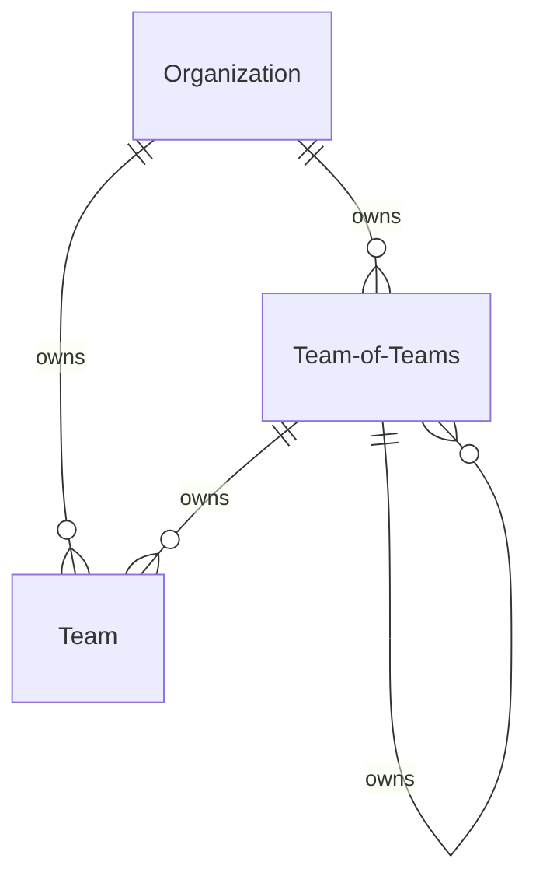

# Organization Domain
The organization domain defines how employees are grouped within teams all the way up to division/business units.

# Models
- [Organization](#organization)
- [Team of Teams](#team-of-teams)
- [Team](#team)

## Organization
The organization is the top level of the organizational hierarchy and is a way to group teams and teams of teams.  The organization could represent the whole company, a division, or a business unit.

## Team of Teams
A team of teams is way to group a set of teams or team of teams depending on the size of the company.

A team of teams can have a team of teams or an organization as a parent.

## Team
The team is the lowest level of the organizational hierarchy and is made up of multiple employees responsible for work execution for a given area.

A team can have a team of teams or an organization as a parent.

# Open Questions
- [ ] Should we use a graph db here or a sqlhierarchyid?

# ERD
