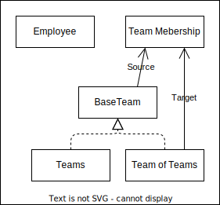

# Organization Domain
The organization domain defines how employees are grouped within teams all the way up to divisions/business units as team of teams.

# Models
- [Team of Teams](#team-of-teams)
- [Team](#team)
- [Team Membership](#team-memberhsip)
- [Employee](#employee)

## Team of Teams
A team of teams is way to group a set of teams or team of teams depending on the size of the company.

A team of teams can have a team of teams as a parent.

## Team
The team is the lowest level of the organizational hierarchy and is made up of multiple employees responsible for work execution for a given area.

A team can have a team of teams as a parent.

## Team Membership
Team Memberships provide a way to manage the parent child hierarchy between teams and teams of teams.  Each team or team of teams can only have one parent for a given date or date range.

## Employee
A person that works for a company.

# Logical Diagram

# ERD
