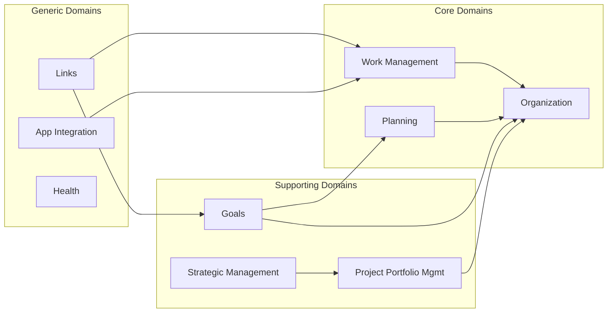
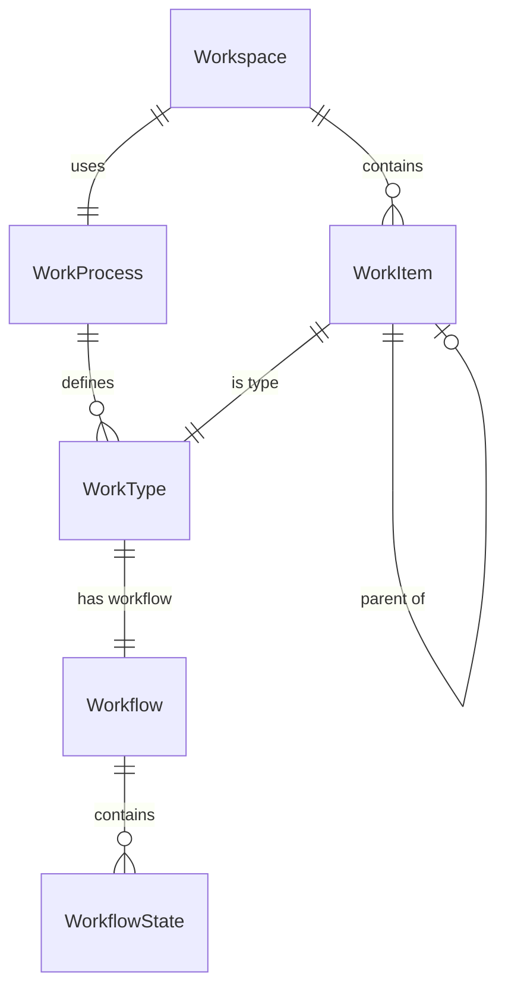

# Domain Model

Moda is organized into bounded contexts (domain services), each responsible for a distinct area of the business domain.

## Domain Map

## Work Management (`Moda.Work`)

The core domain for tracking and managing work.

### Entities

| Entity | Description |
|--------|-------------|
| **WorkItem** | The fundamental unit of work (task, bug, story, etc.) |
| **WorkType** | Category of work item defined by a work process |
| **Workflow** | State machine defining valid status transitions |
| **WorkflowState** | A status within a workflow |
| **WorkProcess** | Template defining work types and workflows |
| **Workspace** | Container for work items using a specific work process |

### Relationships

## Organization (`Moda.Organization`)

Manages teams and organizational structure.

### Entities

| Entity | Description |
|--------|-------------|
| **Team** | A delivery team or team of teams |
| **Employee** | An individual in the organization |
| **TeamMembership** | Association between employee and team |

## Planning (`Moda.Planning`)

Time-based planning and scheduling.

### Entities

| Entity | Description |
|--------|-------------|
| **PlanningInterval** | A fixed time period for planning (PI) |
| **Iteration** | A time-boxed period within a planning interval |

## Goals (`Moda.Goals`)

OKR framework for strategic and team-level goals.

### Entities

| Entity | Description |
|--------|-------------|
| **Objective** | A qualitative goal to achieve |
| **KeyResult** | A quantitative measure of progress |

## Project Portfolio Management (`Moda.ProjectPortfolioManagement`)

Project and portfolio lifecycle management.

### Entities

| Entity | Description |
|--------|-------------|
| **Project** | A distinct initiative with scope and timeline |
| **Portfolio** | A collection of related projects |

## Links (`Moda.Links`)

Cross-entity relationship management.

### Entities

| Entity | Description |
|--------|-------------|
| **Link** | An association between any two entities |

## App Integration (`Moda.AppIntegration`)

External system integration configuration.

### Entities

| Entity | Description |
|--------|-------------|
| **Connection** | Configuration for an external system connection |

## Cross-Cutting: Common Domain

`Moda.Common.Domain` provides base types used across all domains:

- **BaseEntity** - Base class for all entities
- **AuditableEntity** - Entity with created/modified tracking
- **IHasOwnership** - Interface for owned vs. managed entities
- **SystemContext** - Enum for Moda vs. external system context
