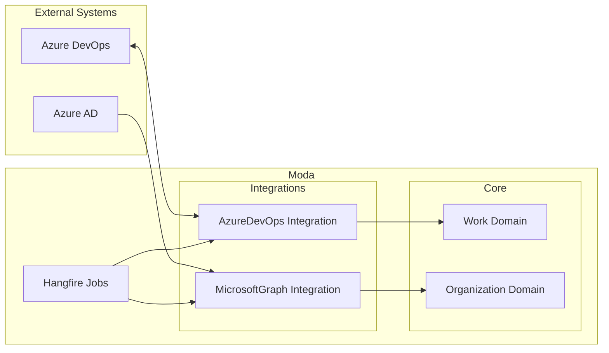

# Integrations

Moda integrates with external systems to synchronize data bidirectionally.

## Azure DevOps

`Moda.Integrations.AzureDevOps` provides bidirectional work item synchronization with Azure DevOps.

### Capabilities

- Sync work items from Azure DevOps projects into Moda workspaces
- Map Azure DevOps work item types to Moda work types
- Maintain ownership tracking (Managed items are read-only in Moda)
- Background synchronization via Hangfire jobs

### How It Works

1. An **App Integration Connection** is configured in Moda settings
2. Azure DevOps projects are mapped to Moda **Workspaces**
3. Hangfire **recurring jobs** sync work items on a schedule
4. Synced items have **Managed** ownership and are read-only in Moda

## Microsoft Graph

`Moda.Integrations.MicrosoftGraph` synchronizes employee and user data from Azure Active Directory.

### Capabilities

- Import employees from Azure AD
- Keep employee information up to date
- Map AD users to Moda employees

## Integration Architecture

## Adding a New Integration

1. Create a new project: `Moda.Integrations.{SystemName}`
2. Implement the integration logic following the existing patterns
3. Register Hangfire jobs for scheduled synchronization
4. Add connection configuration to App Integration
