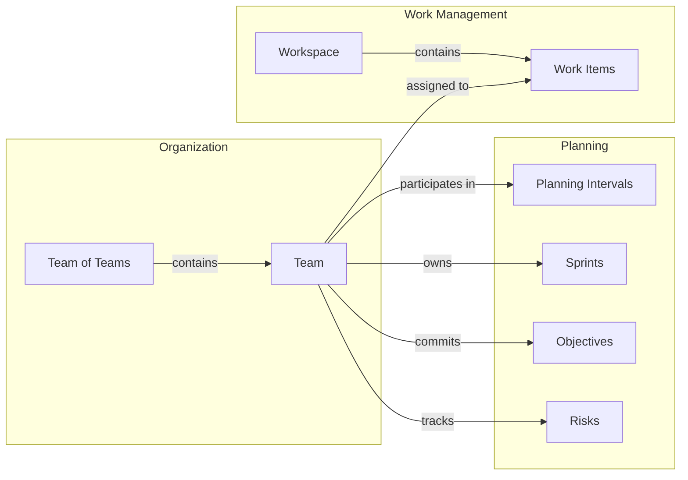
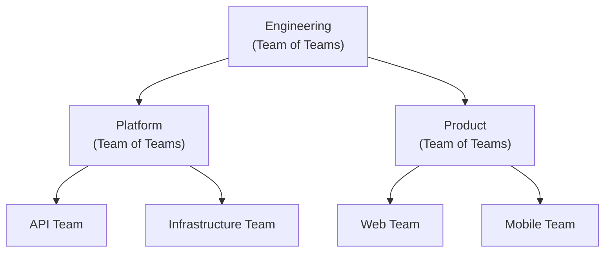

# Organizations

The Organization domain defines how people are grouped into teams and how those teams relate to each other through a hierarchical structure of teams and teams of teams. Teams are the central organizing concept in Moda — they own work, participate in planning, manage risks, and track delivery metrics.

## How Teams Connect Across Moda

Teams are not isolated to the Organization domain. They are a cross-cutting concept referenced throughout the system:



- **[Planning Intervals](../planning/planning-intervals)** — Teams participate in PIs, committing to [objectives](../planning/planning-intervals#objectives) and mapping [sprints](../planning/sprints) to [iterations](../planning/planning-intervals#iterations-within-a-pi).
- **[Sprints](../planning/sprints)** — Each team owns sprints that define their time-boxed delivery cadence. Sprint performance is measured with [sprint metrics](../planning/sprints#sprint-metrics).
- **[Objectives](../planning/planning-intervals#objectives)** — Teams commit to objectives within each PI, tracked for [predictability](../planning/planning-intervals#predictability).
- **[Risks](../planning/risks)** — Teams identify and manage risks that could impact delivery using the [ROAM model](../planning/risks).
- **[Work Items](../work-management/work-items#work-items)** — Work items in [workspaces](../work-management/work-items#workspaces) are assigned to teams and team members.

## Key Concepts

### Teams

A **Team** is the fundamental organizational unit in Moda. It represents a collection of people that work together to execute against a prioritized set of goals.

Every team has:
- **Name** — A descriptive name (up to 128 characters)
- **Code** — A unique 2-10 character uppercase alphanumeric identifier (e.g., `PLATFORM`, `MOBILE`)
- **Active Date** — When the team was formed
- **Inactive Date** — When the team was dissolved (if applicable)
- **Operating Model** — How the team works (methodology and sizing)

Teams can be members of a Team of Teams, establishing the organizational hierarchy.

### Teams of Teams

A **Team of Teams** is a higher-level organizational unit that groups multiple teams (or other teams of teams) together. This enables organizations to model their full hierarchy — from individual delivery teams up through departments and business units.



A Team of Teams shares the same core properties as a Team (name, code, dates) but has additional capabilities:
- It can contain child teams and child teams of teams
- It can also be a member of a parent Team of Teams
- It provides rollup visibility across its descendant teams

**Team of Teams** have a simplified detail page focused on hierarchy and risk management. They do not have backlogs, sprints, or delivery metrics — those belong to the leaf-level delivery teams.

### Operating Model

Each team has an **Operating Model** that defines how it works. The operating model tracks:

- **Methodology** — The team's delivery approach:
  - **Scrum** — Sprint-based with time-boxed iterations, sprint backlog, and sprint planning
  - **Kanban** — Continuous flow, pulling from a product backlog
- **Sizing Method** — How the team estimates work:
  - **Story Points** — Relative sizing using story points
  - **Count** — Simple item count (each item = 1)

Operating models have an effective date range, creating a history. When a team changes its methodology (e.g., moving from Kanban to Scrum), a new operating model is added and the previous one is automatically closed the day before the new one starts.

The operating model affects what the team sees in the UI:
- **Scrum teams** see a **Sprints** tab and an **Active Sprint** indicator on their detail page
- **Kanban teams** do not see sprint-related UI
- The **Sizing Method** determines how work is measured in backlog views and metrics

### Team Memberships

**Team Memberships** define the parent-child relationships in the organizational hierarchy. Each membership has a date range, allowing the hierarchy to change over time.

Memberships have a state based on the current date:
- **Past** — The membership has ended
- **Active** — The membership is currently in effect
- **Future** — The membership hasn't started yet

Membership rules:
- A team can only have one active parent membership at a time
- Membership date ranges cannot overlap for the same team
- Circular references are not allowed (a team cannot be an ancestor of itself)
- Both the child and parent must be active for a membership to be created

## Team Detail Page

The team detail page is the central hub for understanding and managing a team. It provides tabs for different aspects of the team's work and delivery.

### Details Tab

The **Details** tab shows the team's core properties:
- Code, Type, and Parent Team (with link to parent Team of Teams)
- Active and Inactive dates
- Current Methodology and Sizing Method (from the operating model)
- Description (rendered as Markdown)
- **Active Team Sprint** — For Scrum teams, shows the current sprint with start/end dates and sizing method

### Backlog Tab

The **Backlog** tab shows all work items assigned to the team across all workspaces. This gives the team a unified view of their work regardless of which workspace it lives in.

The backlog is displayed as a grid with sortable and filterable columns. It pulls work items where the team is assigned, providing a single-pane view of everything the team needs to work on.

### Sprints Tab

> Only visible for teams that have ever used the Scrum methodology.

The **Sprints** tab shows all sprints owned by the team — past, active, and future. Each sprint displays its name, date range, state (Future, Active, Completed), and type.

Sprints are the time-boxed delivery cadence for Scrum teams. They are created in the [Planning](../planning/index) domain and mapped to [PI iterations](../planning/planning-intervals#iterations-within-a-pi). See [Sprints](../planning/sprints) for details on how sprints work and [Sprint Metrics](../planning/sprints#sprint-metrics) for the metrics tracked per sprint.

### Dependency Management Tab

The **Dependency Management** tab shows all cross-work-item dependencies involving the team. Dependencies are predecessor/successor relationships between work items that help teams identify blockers and delivery risks.

The dependency grid is organized into three column groups:

| Group | Columns |
|-------|---------|
| **Dependency Info** | State (To Do, In Progress, Done), Health (Healthy, At Risk, Unhealthy), Scope (Intra-Team, Cross-Team) |
| **Predecessor** | Work Item Key, Title, Type, Status, Team, Sprint |
| **Successor** | Work Item Key, Title, Type, Status, Team, Sprint |

Dependencies are color-coded by health:
- **Healthy** — The predecessor is planned to finish before the successor needs to start
- **At Risk** — One or both items are unplanned
- **Unhealthy** — The predecessor is planned after the successor, creating a scheduling conflict

See [Work Item Dependencies](../work-management/work-items#work-item-dependencies) for details on how dependency health is calculated.

### Risk Management Tab

The **Risk Management** tab shows risks associated with the team. Risks represent potential circumstances that could impact delivery.

The risk grid supports:
- Viewing all open risks for the team
- Toggling **Include closed risks** to see historical risks
- Creating new risks directly from the tab

Each risk includes summary, status (Open/Closed), category (Resolved, Owned, Accepted, Mitigated), impact, likelihood, exposure, assignee, and follow-up date. See [Risks](../planning/risks) for details on the risk model.

### Team Memberships Tab

The **Team Memberships** tab shows the team's position in the organizational hierarchy — both the parent Team of Teams it belongs to and any child team relationships.

Each membership displays:
- Child Team and Parent Team (with links)
- Membership State (Past, Active, Future)
- Start and End dates

Memberships can be edited or deleted from this tab (with appropriate permissions).

### Operating Model History (Report)

Available from the **Reports** menu, this tab shows the full history of the team's operating model changes over time. Each entry shows:
- Start and End dates
- Methodology (Scrum or Kanban)
- Sizing Method (Story Points or Count)
- Status (Current or Historical)

Only the current operating model can be edited or deleted (and deletion is only possible if there are multiple models — a team must always have at least one).

### Cycle Time Report (Report)

Available from the **Reports** menu, the **Cycle Time Report** analyzes how long it takes the team to complete work items. It helps teams understand delivery cadence, identify bottlenecks, and forecast future work.

#### What is Cycle Time?

**Cycle Time** measures the number of days between when work starts (moves to Active status) and when it finishes (moves to Done status):

```
Cycle Time = Done Timestamp − Activated Timestamp (in days)
```

Only **Requirement-tier** work items (e.g., User Stories, Bugs) with both an Activated and Done timestamp are included. Portfolio-tier items (Epics, Features) and items that were Removed without being completed are excluded.

Related metrics shown on work item detail pages:
- **Time to Start** — Days from creation to activation (how long work sits before starting)
- **Lead Time** — Days from creation to completion (total time from request to delivery)

#### Configuring the Report

The report has three controls:

**Done From (Date Range)**
- Filters work items completed on or after this date
- Presets: 30, 60, 90, 120, or 180 days (default: 90 days)
- All dates are in UTC

**Percentile (0-100%)**
- Controls what percentage of work items to include after removing outliers
- At 100%, all items are shown (no filtering)
- Lower values remove extreme cycle times that skew averages

**Outlier Method**
- Determines *how* outliers are identified and removed when percentile is below 100%:

| Method | How It Works | Best For |
|--------|-------------|----------|
| **Balanced** | Trims equally from both the fastest and slowest items. At 80th percentile, removes the top 10% and bottom 10%. | Understanding typical cycle time by excluding both unusually fast and slow items |
| **Forecasting** | Removes only the slowest items. At 80th percentile, keeps the fastest 80% of items. | Predicting delivery dates — excludes only the outliers that would make forecasts unreliable |

**Example:** With 10 items sorted by cycle time (1, 2, 3, 4, 5, 6, 7, 8, 9, 15 days) at the 80th percentile:
- **Balanced** keeps items 2-9 (removes bottom 10% and top 10%)
- **Forecasting** keeps items 1-8 (removes the slowest 20%)

#### Chart Visualization

The **Cycle Time Analysis Chart** is a column chart that groups completed work items by story points and shows the average cycle time for each group:

- **X-axis** — Story point categories (1, 2, 3, 5, 8, etc.) plus "No Story Points" and "Overall"
- **Y-axis** — Average cycle time in days
- Color coding: primary blue for story point groups, orange for "No Story Points", green for "Overall"

This helps teams answer questions like:
- "Do our 8-point stories really take longer than 3-point stories?"
- "Is our estimation accurate — do similarly-sized items have similar cycle times?"
- "What's our average cycle time across all work?"

#### Work Items Grid

Below the chart, a sortable and filterable grid shows all included work items with columns for Key, Title, Type, Status, Story Points, Team, Sprint, Assigned To, Activated date, Done date, and Cycle Time (days).

**Interactive filtering:** Applying column filters in the grid (e.g., filtering by a specific work type) dynamically updates the chart above. This lets you drill into cycle time by type, sprint, assignee, or any other dimension.

#### Using Cycle Time for Improvement

- **Track trends** — Run the report monthly to see if cycle time is improving
- **Compare story point groups** — If 5-point and 8-point stories have similar cycle times, your estimation may need calibration
- **Identify bottlenecks** — Items with unusually long cycle times may indicate process issues
- **Forecast delivery** — Use the Forecasting method at the 85th percentile to estimate "most items will complete within X days"
- **Set WIP limits** — High cycle times often indicate too much work in progress

## Functional Organization Chart

Moda renders a **Functional Organization Chart** that visualizes the complete team hierarchy as of a specific date. Navigate to **Organizations > Functional Org Chart** to see how teams are structured across the organization.

## Common Tasks

### Creating a Team

1. Navigate to **Organizations > Teams**
2. Click **Create Team**
3. Enter a **Name**, **Code**, and **Active Date**
4. Optionally add a **Description** (supports Markdown)
5. The team is created with a default operating model

### Creating a Team of Teams

1. Navigate to **Organizations > Teams** (Team of Teams are listed alongside teams)
2. Click **Create Team of Teams**
3. Enter a **Name**, **Code**, and **Active Date**
4. Optionally add a **Description**

### Managing Team Hierarchy

To add a team to a Team of Teams:
1. Navigate to the team's detail page
2. Go to the **Team Memberships** tab
3. From the page actions menu, click **Add Team Membership**
4. Select the parent Team of Teams
5. Set the start date (required) and end date (optional for ongoing membership)

### Changing a Team's Operating Model

1. Navigate to the team's detail page
2. From the page actions menu, choose **Operating Model > Set Operating Model**
3. Select the new **Methodology** and **Sizing Method**
4. Set the **Start Date** — the previous model will automatically close the day before

To update the current model without creating a new one:
1. From the page actions menu, choose **Operating Model > Update Operating Model**
2. Change the **Methodology** or **Sizing Method**

### Deactivating a Team

1. Navigate to the team's detail page
2. From the page actions menu, click **Deactivate**
3. Set the **Inactive Date**

> A team cannot be deactivated if it has active parent memberships that extend past the deactivation date. Those memberships must be ended first.

### Viewing Team Metrics

1. Navigate to the team's detail page
2. From the page actions menu, open **Reports > Cycle Time Report**
3. Configure the date range and filters to analyze delivery performance

## Teams List Page

The **Teams** page (**Organizations > Teams**) shows all teams in a grid with columns:
- Key, Name, Code, Type, Team of Teams (parent), Is Active

Features:
- Sortable columns
- **Include Inactive** toggle to show/hide inactive teams
- Click a team name to navigate to its detail page

## Business Rules

| Rule | Description |
|------|-------------|
| Unique name | Team names must be unique across all teams and teams of teams |
| Unique code | Team codes must be unique across all teams and teams of teams |
| Code format | Codes must be 2-10 uppercase alphanumeric characters |
| Single parent | A team can only have one active parent membership at a time |
| No circular refs | A team cannot be a member of itself or create circular hierarchies |
| Active required | Both teams must be active to create a membership |
| Deactivation check | Cannot deactivate a team with active memberships extending past the inactive date |
| Operating model history | A team must always have at least one operating model |
| Operating model dates | New operating model start date must be after the current model's start date |
