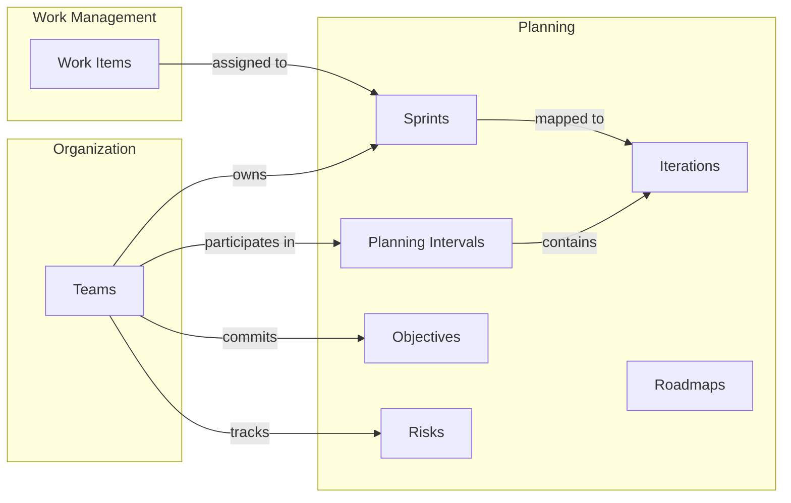
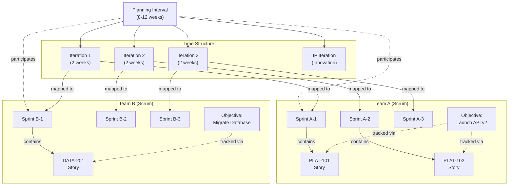

# Planning

The Planning domain provides the capabilities to plan, organize, and execute work across periods of time. It supports scaled agile planning with planning intervals, iterations, sprints, team objectives, risk management, roadmaps, and collaborative estimation.

## How Planning Connects Across Moda

Planning is where teams, work, and strategy come together:

- **[Teams](../organizations/index.mdx#teams)** participate in Planning Intervals and own Sprints. Teams see their sprints on the [Sprints tab](../organizations/index.mdx#sprints-tab) and risks on the [Risk Management tab](../organizations/index.mdx#risk-management-tab).
- **[Work Items](../work-management/work-items.mdx#work-items)** are assigned to Sprints for execution. Sprint assignment is visible on the [work item detail page](../work-management/work-items.mdx#work-item-detail-page).
- **[Objectives](./planning-intervals.mdx#objectives)** link team commitments to strategic outcomes.

## The Big Picture

A Planning Interval brings together teams, objectives, sprints, and work items into a coordinated delivery cycle:

**How it fits together:**
1. A **[Planning Interval](./planning-intervals.mdx)** defines the overall timeframe and contains **[Iterations](./planning-intervals.mdx#iterations-within-a-pi)** (the schedule)
2. **[Teams](../organizations/index.mdx#teams)** participate in the PI and each team owns **[Sprints](./sprints.mdx)**
3. Each team's sprints are **[mapped](./planning-intervals.mdx#sprint-mapping)** to PI iterations (one sprint per team per iteration)
4. Teams commit to **[Objectives](./planning-intervals.mdx#objectives)** — what they will deliver during the PI
5. **[Work Items](../work-management/work-items.mdx#work-items)** live in sprints and represent the actual work being done
6. Objectives are tracked by linking them to the work items that fulfill them

The PI iteration view aggregates all mapped sprints, giving you a cross-team view of what's happening in each time period.

## Sections

- **[Planning Intervals](./planning-intervals.mdx)** — PIs, iterations, sprint mapping, objectives, predictability, and plan review
- **[Sprints & Metrics](./sprints.mdx)** — Sprint management and delivery metrics (velocity, cycle time, completion rate)
- **[Risks](./risks.mdx)** — Risk identification and management using the ROAM model
- **[Roadmaps](./roadmaps.mdx)** — Visual timeline planning with activities, milestones, and timeboxes
- **[Planning Poker](./planning-poker.mdx)** — Collaborative estimation with real-time voting
