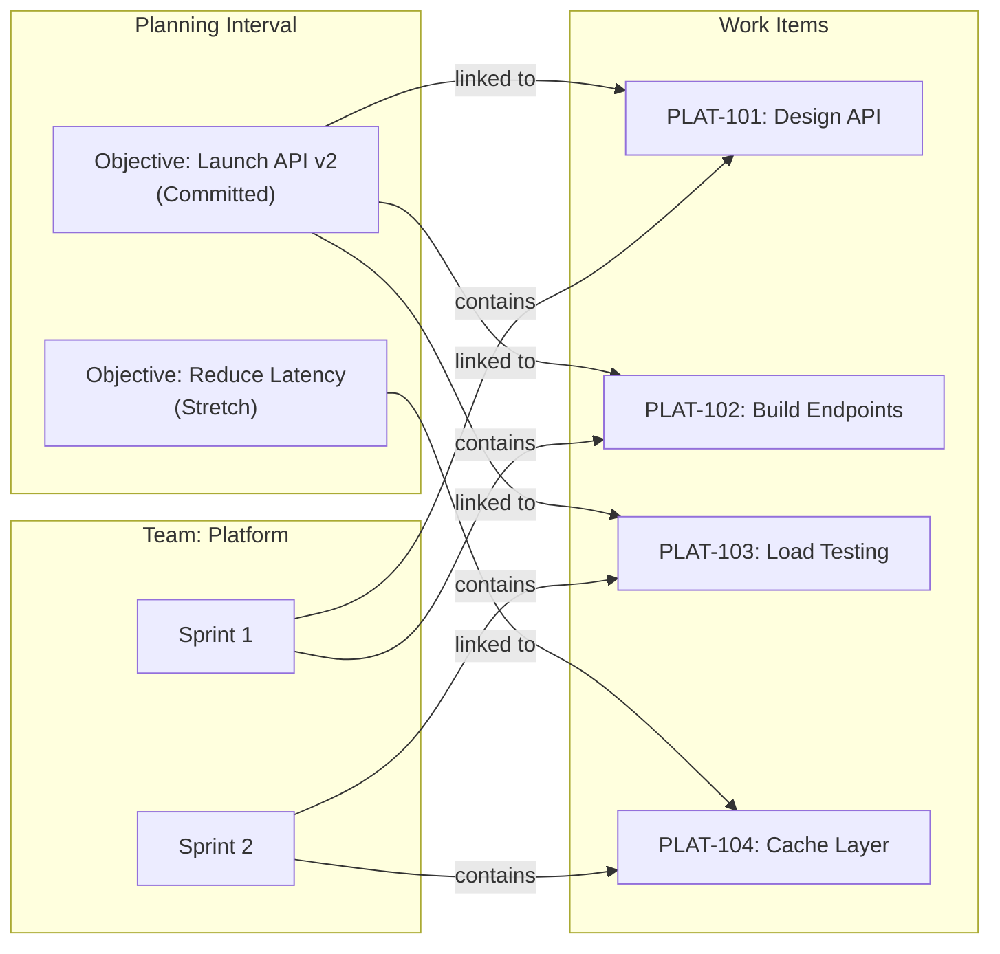

# Planning Intervals

A **Planning Interval** (PI) is a fixed timeframe — typically 8-12 weeks — during which a group of teams delivers value toward committed objectives. It is the primary unit of scaled planning in Wayd.

Every planning interval has:
- **Name** and optional **Description**
- **Date Range** — Start and end date for the PI
- **Teams** — The [teams](../organizations/index.mdx#teams) and [teams of teams](../organizations/index.mdx#teams-of-teams) participating
- **Iterations** — Time-boxed periods within the PI (typically 2-week sprints)
- **[Objectives](#objectives)** — Team commitments for the PI
- **Objectives Locked** — Flag to prevent changes to objectives after PI planning

A PI has a state based on the current date:
- **Future** — Start date hasn't arrived yet
- **Active** — Currently in progress
- **Completed** — End date has passed

## PI Detail Page

The PI detail page is the command center for a planning interval. **Horizontal navigation** across the top provides quick access to:

- **Overview** — At-a-glance metrics, iteration cards, and team performance
- **[Plan Review](#plan-review)**
- **[Objectives](#objectives)**
- **[Risks](./risks.mdx)**
- **Reports** (Health Report)
- **Teams** — Grid of all [teams](../organizations/index.mdx#teams) assigned to the PI
- **Sprint Mappings** — Configuration grid mapping each team's [sprints](./sprints.mdx) to PI iterations

### Overview Tab

The Overview page composes four sections that adapt based on PI state.

#### At a Glance

A summary card showing the PI's current health at a single glance:

- **Timeline progress bar** — Visual bar showing how much of the PI's date range has elapsed
- **Teams** — Number of delivery teams participating (Teams of Teams excluded)
- **PI Predictability** — Percentage of committed (non-stretch) objectives completed, with a breakdown of completed / regular / stretch counts. Hidden for Future PIs and when no objectives exist.
- **Avg Cycle Time** — Average cycle time across all work items completed in the PI. Only shown for Active and Completed PIs when cycle time data is available.

When objectives exist (Active and Completed PIs only), three charts are shown beneath the metrics:

- **Team Predictability Radar Chart** — Multi-axis radar showing each team's predictability score
- **Objective Status Chart** — Pie chart grouping all PI objectives by status (Not Started, In Progress, Completed, Missed, Canceled)
- **Objective Health Chart** — Pie chart grouping open objectives by health check status (Healthy, At Risk, Unhealthy, Unknown)

#### Iterations

A row of clickable cards — one per iteration — sorted chronologically. Each card shows:

- Iteration name and category (Development or Innovation and Planning)
- Date range
- For the **active** iteration: current day and total days (e.g. "Day 4/10") and a **health flag** (green = On Track, orange = At Risk, red = Off Track) calculated from sprint completion progress
- Cards are highlighted: active iterations use the primary colour, Innovation and Planning iterations use a warning/amber tint

Click an iteration card to navigate to its detail page, where you can see the aggregated sprint backlog and metrics across all participating teams.

#### Teams

A responsive grid of team performance cards, one per participating team. Each card links to that team's tab on the [Plan Review](#plan-review) page and shows:

- **Predictability** for the PI with a breakdown of completed / regular (non-stretch) / stretch objective counts
- **Avg Cycle Time** for the team's sprints
- **Objective Status Chart** and **Objective Health Chart** for the team's objectives (shown when the team has objectives)

This section is hidden for Future PIs.

#### Needs Attention — Objectives

Only shown for **Active** PIs. Highlights objectives that are At Risk or Unhealthy and have not yet been completed, so the team can take action before the PI ends.

- Sort the list by **health** (Unhealthy first), **progress**, or **team** using the segmented control
- Click an objective card to open its details drawer for inline updates and health checks
- The section is hidden if no objectives currently need attention

## Iterations within a PI

Each PI contains **Iterations** that define the sprint schedule. Iterations have:
- **Name** — Descriptive name (e.g., "Sprint 1", "IP Sprint")
- **Category** — Purpose of the iteration:
  - **Development** — Standard delivery sprint
  - **Innovation and Planning** — Time for planning, innovation, and technical debt
- **Date Range** — Must fall within the PI's date range

Iterations can be auto-generated using **Initialize Iterations** which creates evenly spaced iterations by week length, or added individually.

#### Iteration Health

The active iteration's card on the Overview page shows a colour-coded health flag calculated from sprint completion progress relative to elapsed time:

- **On Track** (green) — Completion rate is at or ahead of where it should be for the current day
- **At Risk** (orange) — Slightly behind pace
- **Off Track** (red) — Significantly behind pace

### PI Iteration Detail Page

A PI iteration groups all matching [sprints](./sprints.mdx) from participating teams into a single aggregate view. When multiple teams participate in a PI, each team's sprint is mapped to the corresponding iteration (see [Sprint Mapping](#sprint-mapping)). The iteration detail page rolls up metrics from all mapped sprints, giving you a cross-team view of progress.

**Summary Tab:**
- **Timeline progress bar** — Visual indicator of time elapsed from start to end date
- **Team Count** — Number of distinct teams with sprints mapped to this iteration
- **Sprint Count** — Total number of sprints included in the aggregation
- **Aggregate Metrics** (for Active/Completed iterations, see [Sprint Metrics](./sprints.mdx#sprint-metrics) for definitions):
  - Total/Completed/Remaining story points (or item counts)
  - Completion Rate percentage
  - Velocity
  - Average Cycle Time across all teams' sprints
  - Missing Story Points count
- Metrics can be toggled between **Story Points** and **Count** sizing methods

**Backlog Tab:**
- Combined sprint backlog grid showing [work items](../work-management/work-items.mdx#work-items) from all mapped sprints
- Columns: Rank, Key, Type, Title, Story Points, Status, Status Category, Team

> **Tip:** Click on an iteration card on the Overview tab to navigate directly to its detail page.

**Business rules:**
- Iteration names must be unique within a PI
- Iteration dates must fall within the PI's date range
- Iteration dates cannot overlap with each other

## Sprint Mapping

Team [Sprints](./sprints.mdx) are mapped to PI iterations. This mapping connects each team's delivery cadence to the broader PI schedule, enabling aggregate views and cross-team coordination.

**Rules:**
- A team can only have one sprint per iteration
- The sprint must belong to a team that is part of the PI
- Removing a team from a PI also removes its sprint mappings

## Objectives

**Planning Interval Objectives** represent commitments from teams to deliver specific outcomes within a PI. They are the core mechanism for PI-level planning and tracking.



Objectives bridge the gap between strategic intent and execution. A team commits to objectives during PI planning, then links [work items](../work-management/work-items.mdx#work-items) that fulfill those objectives. As work items are completed in [sprints](./sprints.mdx), objective progress is tracked.

Each objective has:
- **Team** — The [team](../organizations/index.mdx#teams) committing to the objective
- **Type** — Team objective or Team of Teams objective
- **Status**:
  - **Not Started** — Work hasn't begun
  - **In Progress** — Actively being worked on
  - **Completed** — Successfully delivered
  - **Canceled** — Removed from scope
  - **Missed** — Not delivered by PI end
- **Is Stretch** — Whether this is a stretch goal (aspirational) vs. a committed objective
- **Health Check** — Optional health indicator (Healthy, At Risk, Unhealthy) with expiration

**Business rules:**
- Objectives can only be created when the PI's `ObjectivesLocked` flag is false
- When objectives are locked, the stretch flag cannot be changed

### Objectives Page

The objectives page for a PI offers two views:

**List View** — AG Grid with columns: Key, Name, Is Stretch, Status, Team, Health, Progress (bar), Start Date, Target Date, Order

**Timeline View** — Visual timeline grouped by team, showing objectives as bars across the PI timeline. Only shows delivery teams (not Teams of Teams).

### Objective Detail Page

Each objective has its own detail page showing:
- Progress bar (colored red for Canceled/Missed objectives)
- PI link, Team link, Status, Is Stretch flag, Start/Target/Closed dates, Type
- Description (Markdown)
- **Health Report Chart** — Historical health check status over time
- **Work Items Card** — Grid of linked [work items](../work-management/work-items.mdx#work-items) with ability to link/unlink
- **Links Card** — Cross-entity associations

Actions: Edit, Delete, Create Health Check

### Objectives Health Report

The health report page (**Reports > Health Report**) shows all PI objectives in a grid with Key, Name, Is Stretch, Status, Team, Progress, Health Status, Note, Reported On, and Expiration. This provides a single view of objective health across all teams.

### Predictability

Wayd calculates **Predictability** for each PI — the percentage of committed (non-stretch) objectives that were completed.

```
Predictability = (Completed committed objectives / Total committed objectives) × 100
```

> **Stretch objectives are excluded** from the predictability calculation. Only committed (non-stretch) objectives count. This ensures predictability measures reliable delivery, not aspirational targets.

Predictability can be calculated:
- **Per-team** — How well did this team deliver on their commitments?
- **Across the PI** — How well did all teams collectively deliver?

Predictability is only calculated for Active or Completed PIs (not Future). It is shown on the Overview tab as a metric with a completed / regular / stretch breakdown, and visualized per-team in the **Team Predictability Radar Chart** and on each team's card in the Teams section.

## Plan Review

The **Plan Review** page provides a team-by-team view of the PI, with one tab per participating team. This is designed for PI planning ceremonies and plan review sessions.

Each team tab shows:
- **Team Predictability** metric (if available from prior PIs)
- Two view modes:
  - **List View** — Objective cards and [risk](./risks.mdx) cards for the team
  - **Timeline View** — Objectives displayed on a timeline

The plan review only shows delivery teams (not Teams of Teams). URL hash navigation (`#team-code`) allows linking directly to a specific team's tab.

## Common Tasks

### Creating a Planning Interval

1. Navigate to **Planning > Planning Intervals**
2. Click **Create Planning Interval**
3. Enter **Name**, **Date Range**, and optional **Description**
4. Use **Manage Dates > Initialize Iterations** to auto-generate sprints by week length, or add them individually
5. Use **Manage Teams** to add participating teams

### Managing Team Objectives

1. Navigate to the PI detail page
2. Click **Objectives** in the horizontal nav
3. Click **Create Objective** for a team
4. Set whether it is a **Stretch** goal
5. Update status as the PI progresses
6. Add **Health Checks** to track objective health over time

### Reviewing PI Health at a Glance

1. Navigate to the PI detail page — the **Overview** tab opens by default
2. Check the **At a Glance** section for timeline progress, predictability, and cycle time
3. Scan the **Iterations** row for the active iteration's health flag
4. Review the **Teams** section for per-team predictability and objective charts
5. On an Active PI, check **Needs Attention** for objectives that are At Risk or Unhealthy

### Reviewing the PI Plan

1. Navigate to the PI detail page
2. Click **Plan Review** in the horizontal nav
3. Review each team's objectives and [risks](./risks.mdx) tab-by-tab
4. Switch between List and Timeline views for different perspectives
