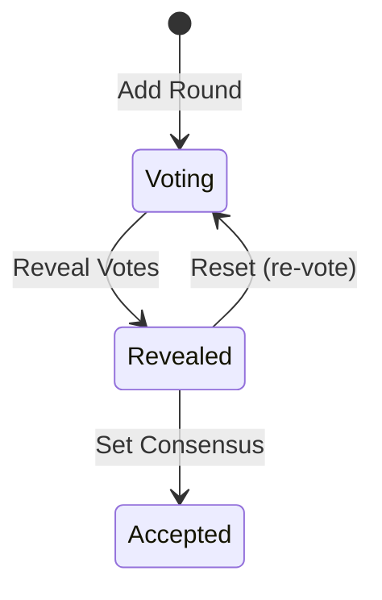

# Planning Poker

> This feature is behind the `planning-poker` feature flag. See [Feature Flags](../settings/index#feature-management) for details.

**Planning Poker** enables [teams](../organizations/index#teams) to estimate work collaboratively using estimation scales. It uses real-time communication (SignalR) for live voting.

## Estimation Scales

An **Estimation Scale** defines the set of values available for voting (e.g., Fibonacci: 1, 2, 3, 5, 8, 13, 21). Scales are configured in [Settings > Planning > Estimation Scales](../settings/index#estimation-scales) and require at least 2 values.

## Poker Sessions

A **Poker Session** is a real-time estimation event:
- Created by a **Facilitator** who manages the session
- Uses a specific **Estimation Scale** (cannot be changed after rounds begin)
- Contains **Rounds** — each round represents one item being estimated
- Sessions are immediately **Active** on creation

## Poker Session Detail Page

The session page has a real-time, multi-column layout:

**Center Column** — Changes based on round status:
- **Lobby** (no active round) — Session name, status, and participant list
- **Voting** — Card deck for selecting estimates, participant cards showing vote status (hidden until reveal)
- **Revealed** — All votes shown simultaneously, results summary
- **Accepted** — Consensus value displayed

**Right Sidebar** — Participant avatars, round list, and Complete Session button

### Round Workflow

- **Voting** — Participants submit estimates from the card deck
- **Reveal** — Facilitator reveals all votes simultaneously
- **Reset** — Clear votes and return to voting (for re-estimation)
- **Consensus** — Facilitator sets the agreed estimate value

### Real-time Features

- Live participant presence indicators
- Real-time vote updates via SignalR
- Copy invite link to share session

### Business Rules

- Sessions are immediately activated on creation
- Rounds can only be added to active sessions
- The estimation scale cannot change after rounds begin
- Only active sessions can be completed

## Common Tasks

### Running a Planning Poker Session

1. Navigate to **Planning > Planning Poker**
2. Click **Create Session**
3. Select an **Estimation Scale** and enter a session **Name**
4. Share the invite link with participants
5. **Add Rounds** for each item to estimate
6. **Reveal** votes when all participants have voted
7. **Set Consensus** or **Reset** to re-vote
8. **Complete** the session when estimation is done
