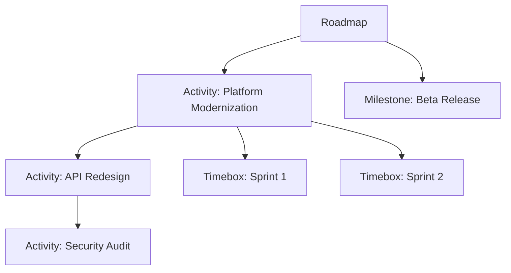

# Roadmaps

**Roadmaps** provide a visual timeline for planning and communicating work across time periods. They support hierarchical items and access-controlled editing.

Every roadmap has:
- **Name** and optional **Description**
- **Date Range** — The time period the roadmap covers
- **Visibility** — Public (visible to all users) or Private (visible to managers only)
- **Managers** — Users with edit access (at least one required)
- **Items** — The content of the roadmap

## Roadmap Items

Roadmaps contain three types of items, which can be nested hierarchically:

- **Activity** — A deliverable or initiative with a date range. Activities can contain child items (other activities, milestones, or timeboxes), enabling a hierarchical work breakdown.
- **Milestone** — A point-in-time marker representing a key date or achievement.
- **Timebox** — A time-bounded period (e.g., a sprint or phase).

All items support an optional **Color** property for visual differentiation.

## Roadmap Detail Page

The roadmap detail page offers two views:

**Timeline View** (default) — Visual timeline showing activities, milestones, and timeboxes. Managers can drag and drop items to reorder them.

**List View** — Hierarchical tree grid showing all items with Name, Type, Start Date, End Date, and Status. Supports inline editing for managers and keyboard shortcuts.

Clicking an item opens a **drawer** with full details, edit, and delete actions.

**Actions (for managers):**
- Edit Roadmap (name, description, dates, visibility, managers)
- Create Activity, Create Timebox
- Copy Roadmap (creates a deep copy with new name and managers)
- Delete Roadmap

Roadmaps can be **copied** to create new versions, preserving the full hierarchy of items.

## Common Tasks

### Creating a Roadmap

1. Navigate to **Planning > Roadmaps**
2. Click **Create Roadmap**
3. Enter **Name**, **Date Range**, and **Visibility**
4. Add yourself as a **Manager**
5. Add **Activities**, **Milestones**, and **Timeboxes** to populate the timeline
