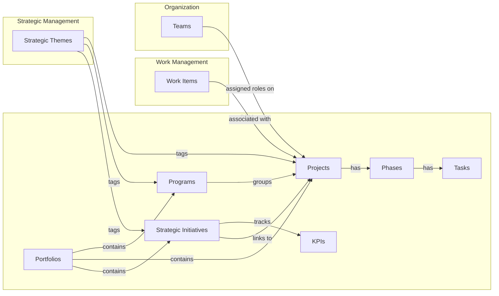

# Project Portfolio Management

Project Portfolio Management (PPM) is a systematic approach to managing an organization's portfolio of projects and programs. It involves the selection, prioritization, and management of projects to align with strategic goals, maximize value, and ensure efficient resource utilization.

## How PPM Connects Across Wayd

PPM sits at the intersection of strategy and execution:

- **[Strategic Themes](../strategic-management/index.mdx#strategic-themes)** tag projects, programs, and initiatives for alignment. See [how themes connect to PPM](../strategic-management/index.mdx#how-strategic-themes-connect-to-other-domains).
- **[Work Items](../work-management/work-items.mdx#work-items)** from [workspaces](../work-management/work-items.mdx#workspaces) can be associated with projects on the [Project Work Items tab](./projects.mdx#project-detail-page).
- **[Teams](../organizations/index.mdx#teams)** are assigned roles on projects (Sponsor, Owner, Manager, Member).

## Sections

- **[Portfolios & Programs](./portfolios-programs.mdx)** — Top-level containers, program management, and portfolio governance
- **[Projects](./projects.mdx)** — Project lifecycle, phases, tasks, dependencies, health checks, and the plan tab
- **[Strategic Initiatives](./strategic-initiatives.mdx)** — Initiative tracking with KPIs, checkpoints, and measurements
- **[My Projects Dashboard](./my-projects.mdx)** — Personalized project overview with task metrics

## Business Rules Summary

| Rule | Description |
|------|-------------|
| Portfolio close | All [programs](./portfolios-programs.mdx#programs)/[projects](./projects.mdx) must be closed first |
| Program close | All [projects](./projects.mdx) must be completed/cancelled first |
| Project approval | [Lifecycle](./projects.mdx#project-lifecycles) must be assigned before approval |
| Project activation | Date range required before activation |
| Project deletion | Only Proposed projects can be deleted |
| Task hierarchy | Milestones cannot have children |
| Task deletion | Cannot delete tasks with children or active dependencies |
| Dependencies | Cannot create circular task dependencies |
| Lifecycle lock | Phases cannot be modified after lifecycle activation |
| Financial freeze | [Expenditure category](../settings/index.mdx#expenditure-categories) settings frozen after activation |
| Initiative read-only | Completed/Cancelled [initiatives](./strategic-initiatives.mdx) cannot be modified |
