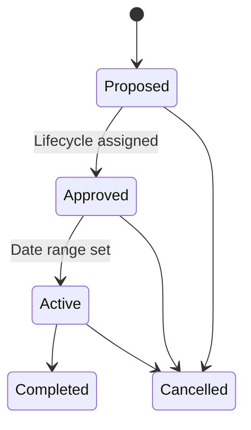
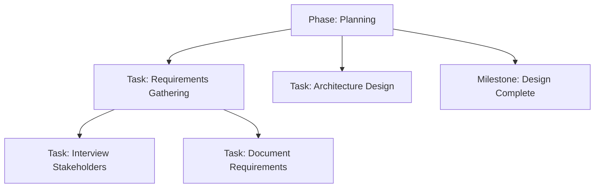

# Projects

A **Project** represents a timed endeavor with defined scope, timeline, and deliverables. Projects are the most feature-rich entities in PPM, supporting full lifecycle management with phases, tasks, and dependencies.

Every project has:
- **Key** — Unique identifier (2-20 uppercase alphanumeric characters, e.g., `APOLLO`)
- **Name**, **Description**, **Business Case**, **Expected Benefits**
- **Status** — Proposed, Approved, Active, Completed, or Cancelled
- **Date Range** — Start and optional end date
- **[Expenditure Category](../settings/index.mdx#expenditure-categories)** — Budget classification
- **[Lifecycle](#project-lifecycles)** — Defines the phases the project goes through
- **Roles** — Sponsor, Owner, Manager, Member
- **[Strategic Theme Tags](../strategic-management/index.mdx#strategic-themes)** — Links to strategic themes

## Project Status Lifecycle

**Business rules:**
- A [lifecycle](#project-lifecycles) must be assigned before a project can be approved
- Active/Completed projects require a date range
- Only Proposed projects can be deleted
- A project can belong to at most one [program](./portfolios-programs.mdx#programs) (or none)
- The project key can be changed (cascades to all [task](#project-tasks) keys)

## Project Detail Page

The project detail page adapts based on the project's status:

**Details Tab** (two-column layout):

*Left sidebar* — [Portfolio](./portfolios-programs.mdx#portfolios) link, [Program](./portfolios-programs.mdx#programs) link (if assigned), date range, [Expenditure Category](../settings/index.mdx#expenditure-categories), Lifecycle name with tooltip, [Strategic Themes](../strategic-management/index.mdx#strategic-themes), Sponsors/Owners/Managers/Members, timeline progress bar, and links.

*Right content area* — Changes based on status:
- **Pre-Execution** (Proposed/Approved): Shows **Project Definition** first (Description, Business Case, Expected Benefits as expandable Markdown sections), then [Phases](#project-phases)/[Tasks](#project-tasks)
- **Execution** (Active+): Shows **[Phases](#project-phases)** first, then Project Definition

The **Phase Timeline** is a step-based visualization showing each phase's status (completed, in progress, not started, cancelled), date range, and progress percentage. It automatically adjusts between horizontal and vertical layout based on available space.

Warning alerts appear when requirements are missing:
- *"Project Dates are required before activating"*
- *"A Project Lifecycle is required before approving"*

**Team Tab** — Grid of all [team](../organizations/index.mdx#teams) members with their roles, showing the people assigned across all project roles.

**Plan Tab** (only visible if lifecycle is assigned) — This is the project's work breakdown structure:

- **Tree grid** with hierarchical [tasks](#project-tasks) organized by [phase](#project-phases)
- **Drag-and-drop** reordering (for users with update permission)
- **Inline-editable columns**: Name, Phase, Type (Task/Milestone), Status, Priority, Start Date, End Date, Planned Date, Assigned Members, Progress %
- **Row actions**: Edit task, Delete task, Add child task
- **Filtering** by task type, status, and priority
- **Keyboard shortcuts** for efficient navigation

**Work Items Tab** — Grid of [work items](../work-management/work-items.mdx#work-items) from Work Management that are associated with this project.

## Project Lifecycles

A **Project Lifecycle** defines the template of phases that a project goes through from inception to completion. Lifecycles are configured in [Settings > PPM > Project Lifecycles](../settings/index.mdx#project-lifecycles).

Lifecycles have a state:
- **Proposed** — Being defined; phases can be added, modified, reordered
- **Active** — In use; phases are locked and cannot be changed
- **Archived** — No longer assignable to new projects (existing projects unaffected)

Each lifecycle contains ordered **Phases** (e.g., Initiation, Planning, Execution, Closing). When a lifecycle is assigned to a project, its phases are copied as [Project Phases](#project-phases) that can then be tracked independently.

**Business rules:**
- Must have at least one phase before activation
- Only Proposed lifecycles can have phases modified
- Only Proposed lifecycles can be deleted

Projects can **change lifecycles** after assignment. When changing, a phase mapping dialog allows you to map [tasks](#project-tasks) from old phases to new phases.

## Project Phases

When a lifecycle is assigned to a project, its template phases become **Project Phases** — concrete instances that track actual progress.

Each phase has:
- **Name** — Copied from the lifecycle template (not editable)
- **Description** — Editable per project
- **Status** — Not Started, In Progress, Completed, or Cancelled
- **Date Range** — Planned start and end dates
- **Progress** — 0-100% completion
- **Roles** — People assigned to work on this phase (Assignee)

## Project Tasks

**Tasks** are the actionable work items within a [project phase](#project-phases). They support a hierarchical work breakdown structure (WBS).

### Task Types

- **Task** — A work item with a date range and partial progress (0-100%)
- **Milestone** — A point-in-time marker with a single target date; can only be Not Started or Completed (no In Progress)

### Task Properties

- **Key** — Auto-generated as `\{ProjectKey\}-\{Number\}` (e.g., `APOLLO-42`)
- **Name** and optional **Description**
- **Type** — Task or Milestone
- **Status** — Not Started, In Progress, Completed, or Cancelled
- **Priority** — Low, Medium, High, or Critical (shown as color indicators)
- **Progress** — 0-100% for tasks; 0 or 100 for milestones
- **Order** — Position within parent for WBS structure
- **Date Range** — Planned start and end dates (tasks) or Planned Date (milestones)
- **Estimated Effort** — Hours estimate
- **Roles** — Assignees
- **[Dependencies](#task-dependencies)** — Finish-to-Start relationships between tasks

### Task Hierarchy

Tasks can contain child tasks, creating a work breakdown structure:

**Business rules:**
- Milestones cannot have child tasks
- Milestones cannot be In Progress (only Not Started or Completed)
- Tasks cannot be deleted if they have children or active dependencies
- Tasks cannot be moved under their own descendants (prevents circular references)

### Task Dependencies

Tasks support **Finish-to-Start** dependencies — a predecessor task must complete before its successor can start. Dependencies are soft-deleted (marked as removed rather than permanently deleted).

> **Note:** These are project task dependencies within PPM. For work item dependencies across [workspaces](../work-management/work-items.mdx#workspaces), see [Work Item Dependencies](../work-management/work-items.mdx#work-item-dependencies).

## Common Tasks

### Creating a Project

1. Navigate to a [portfolio's](./portfolios-programs.mdx#portfolios) detail page, or **PPM > Projects**
2. Click **Create Project**
3. Enter **Name**, **Key** (project code), and **Description**
4. Optionally set **Business Case**, **Expected Benefits**, and **[Expenditure Category](../settings/index.mdx#expenditure-categories)**
5. Assign a **[Lifecycle](#project-lifecycles)** to enable approval
6. Add **Roles** to assign [team](../organizations/index.mdx#teams) members
7. **Approve** the project (requires lifecycle), then **Activate** (requires date range)

### Managing Project Phases and Tasks

1. Navigate to the project detail page
2. Go to the **Plan** tab (visible once a [lifecycle](#project-lifecycles) is assigned)
3. Create [tasks](#project-tasks) within each [phase](#project-phases) — choose Task or Milestone type
4. Set priority, dates, assignees, and estimated effort
5. Drag and drop to reorder tasks within phases
6. Set [dependencies](#task-dependencies) between tasks
7. Track progress and update statuses

### Setting Up a Project Lifecycle

1. Navigate to [Settings > PPM > Project Lifecycles](../settings/index.mdx#project-lifecycles)
2. Click **Create Lifecycle**
3. Add **Phases** in order (e.g., Initiation, Planning, Execution, Closing)
4. **Activate** the lifecycle when the phase list is complete
5. The lifecycle can now be assigned to projects
