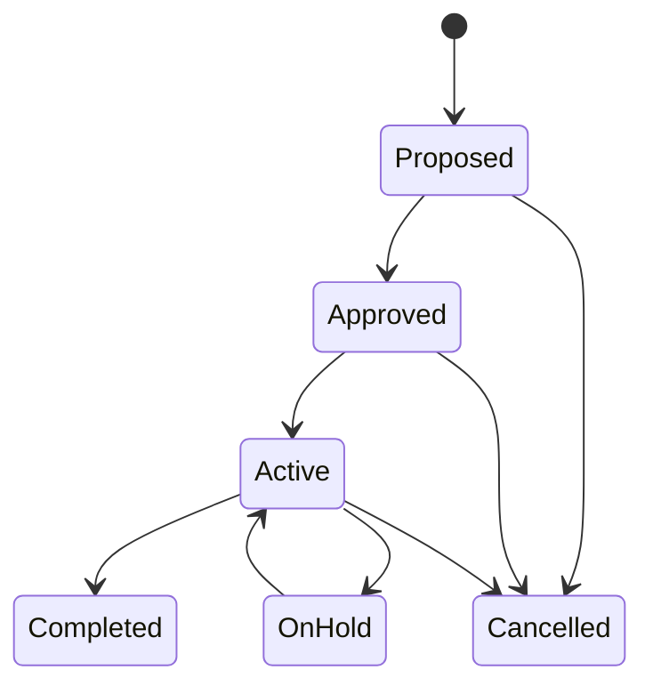

# Strategic Initiatives

**Strategic Initiatives** are high-level strategic efforts within a [portfolio](./portfolios-programs#portfolios), tracked with KPIs (Key Performance Indicators). They bridge the gap between [strategic themes](../strategic-management/index#strategic-themes) and [project](./projects) execution by defining measurable outcomes.

Each initiative has:
- **Name** and **Description**
- **Status** — Proposed, Approved, Active, On Hold, Completed, or Cancelled
- **Date Range** — Timeline for the initiative
- **Roles** — Sponsor and Owner
- **[KPIs](#kpis)** — Measurable indicators with targets, checkpoints, and measurements
- **[Projects](./projects)** — Associated projects that contribute to the initiative

**Business rules:**
- Can only be created in Active or On Hold [portfolios](./portfolios-programs#portfolios)
- Can be deleted only in Proposed or Approved states
- Completed and Cancelled initiatives are read-only

## Strategic Initiative Detail Page

The detail page uses a two-column layout:

*Left sidebar* — [Portfolio](./portfolios-programs#portfolios) link, date range, sponsors/owners, [strategic themes](../strategic-management/index#strategic-themes), description, and links.

*Right content area* — Two sections:

**[KPIs](#kpis)** — Badge showing KPI count, with **Card** and **List** views:
- **Card View**: Visual cards showing KPI name, description, current/target values, checkpoint timeline, health status, and trend indicator. An "Add KPI" card appears when the initiative is editable.
- **List View**: Grid with KPI Name, Description, Baseline, Target, Actual, Health (color-coded), and Trend. Click a KPI to open its detail drawer.

**[Projects](./projects)** — Badge showing project count, with Card/List/Timeline views showing linked projects.

## KPIs

Each KPI tracks progress toward a measurable outcome:
- **Name** and optional **Description**
- **Starting Value** — Baseline measurement
- **Target Value** — Goal to achieve
- **Actual Value** — Automatically set from the most recent measurement
- **Prefix** and **Suffix** — Unit display (e.g., "$" prefix, "%" suffix)
- **Target Direction** — Whether higher or lower values are better (Increase or Decrease)
- **[Checkpoints](#checkpoints)** — Planned target values at specific dates with optional at-risk thresholds
- **[Measurements](#measurements)** — Actual recorded values over time

### Checkpoints

Checkpoints define expected KPI values at specific dates, creating a plan for measuring progress:
- **Checkpoint Date** — When the target should be reached
- **Date Label** — Human-readable label for the date
- **Target Value** — Expected value on that date
- **At-Risk Value** — Optional threshold below which the KPI is considered at risk

Checkpoint dates must be unique within a KPI.

### Measurements

Measurements record actual KPI values over time:
- **Measurement Date** — When the value was recorded
- **Value** — The actual measured value

The most recent measurement automatically becomes the KPI's **Actual Value**. Measurement dates must be unique within a KPI.

## Common Tasks

### Creating a Strategic Initiative

1. Navigate to a [portfolio's](./portfolios-programs#portfolios) Strategic Initiatives tab
2. Click **Create Strategic Initiative**
3. Enter **Name**, **Description**, and **Date Range**
4. Assign **Sponsor** and **Owner** roles
5. Add **[KPIs](#kpis)** with target values and [checkpoints](#checkpoints)
6. Link **[Projects](./projects)** that contribute to the initiative
7. Record **[Measurements](#measurements)** over time to track KPI progress
