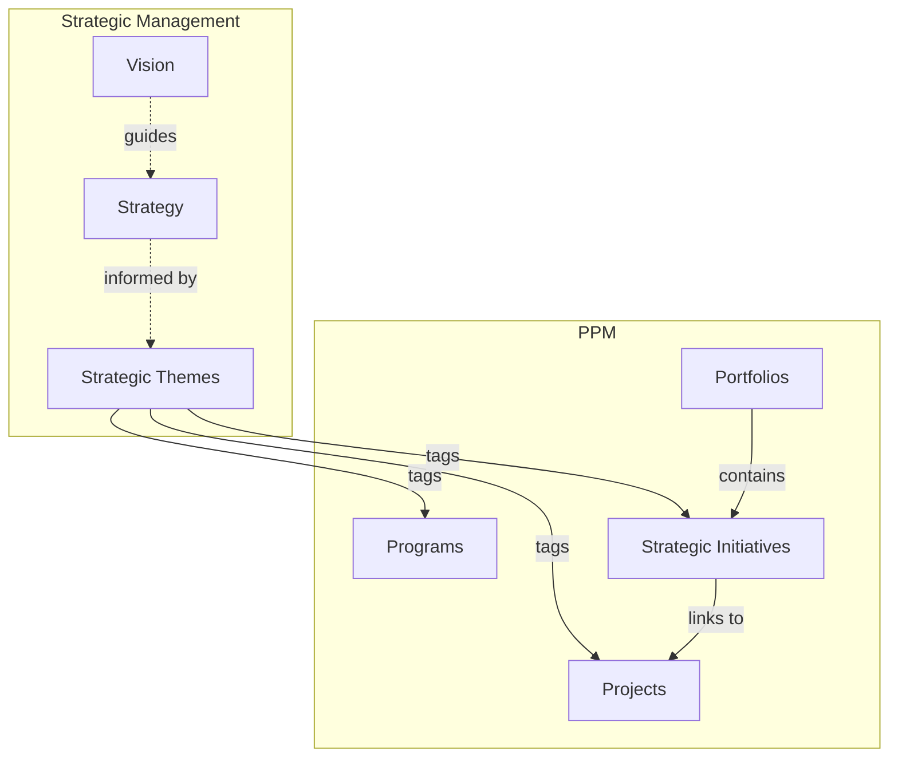
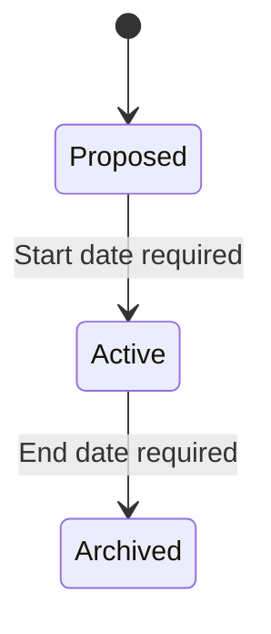
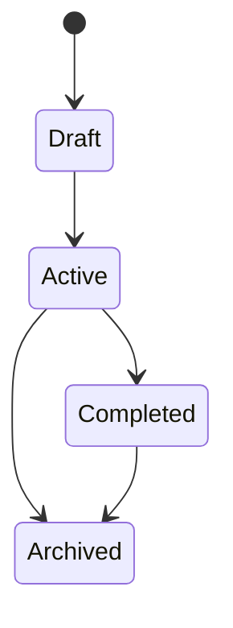
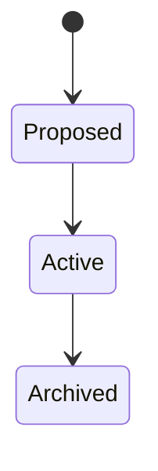

# Strategic Management

The Strategic Management domain supports high-level strategic planning and alignment across the organization. It provides the framework for defining organizational vision, strategies, and themes that guide investment decisions and work prioritization.

## How Strategic Management Connects Across Wayd

Strategic Management provides the "why" behind the "what" in PPM and Planning:

- **[Projects](../ppm/projects.mdx)** and **[Programs](../ppm/portfolios-programs.mdx#programs)** are tagged with strategic themes to show alignment.
- **[Strategic Initiatives](../ppm/strategic-initiatives.mdx)** within [portfolios](../ppm/portfolios-programs.mdx#portfolios) track [KPIs](../ppm/strategic-initiatives.mdx#kpis) that measure strategic progress.
- Strategic themes appear in PPM navigation under **PPM > Strategic Themes**.

## Key Concepts

### Visions

A **Vision** describes the desired future state of the organization. It provides the overarching direction that strategies and themes support.

Every vision has:
- **Description** — The vision statement
- **State** — Proposed, Active, or Archived
- **Dates** — Start and optional end timestamps

**Lifecycle:**

- **Proposed** — Being drafted
- **Active** — The current organizational vision (requires start date)
- **Archived** — A previous vision kept for historical reference (requires end date)

**Business rules:**
- Only **one vision** can be Active at any time — activating a new vision requires archiving the current one first
- Archived visions cannot have overlapping date ranges
- Archived visions cannot be updated

### Strategies

A **Strategy** defines the approach for achieving the vision. Strategies are independent of visions, allowing flexible use cases.

Every strategy has:
- **Name** and optional **Description**
- **Status** — Draft, Active, Completed, or Archived
- **Date Range** — Optional start and end dates

### Strategic Themes

**Strategic Themes** are the primary organizing concept in Strategic Management. They represent high-level organizational priorities that guide investment decisions and work prioritization.

Every theme has:
- **Name** and **Description**
- **State** — Proposed, Active, or Archived

**Business rules:**
- Only Proposed themes can be deleted
- State transitions publish domain events consumed by other domains (PPM maintains a synchronized copy)
- Active themes can be used to tag projects, programs, and strategic initiatives

### How Strategic Themes Connect to Other Domains

Strategic themes are referenced across Wayd to ensure organizational alignment:

- **[Projects](../ppm/projects.mdx)** can be tagged with strategic themes to show which priorities they support
- **[Programs](../ppm/portfolios-programs.mdx#programs)** can be tagged with strategic themes for portfolio-level alignment
- **[Strategic Initiatives](../ppm/strategic-initiatives.mdx)** within portfolios track [KPIs](../ppm/strategic-initiatives.mdx#kpis) to measure strategic progress

This cross-domain tagging enables organizations to answer questions like:
- "Which projects support our Digital Transformation theme?"
- "How much of our portfolio is aligned to each strategic priority?"
- "Are we investing proportionally across our strategic themes?"

Strategic themes appear as filterable tags in PPM grids and timelines, making alignment visible in portfolio, program, and project views.

## Common Tasks

### Defining a Vision

1. Create a new vision with a description of the desired future state
2. Review and refine the vision statement
3. **Activate** the vision (requires start date; only one vision can be Active)
4. When the vision evolves, **Archive** the current vision and create a new one

### Defining Strategic Themes

1. Navigate to **PPM > Strategic Themes**
2. Click **Create Strategic Theme**
3. Enter a **Name** and **Description**
4. The theme is created in **Proposed** state
5. **Activate** the theme when ready for use across the organization

### Tagging Projects with Themes

1. Navigate to a project's detail page
2. Look for the **Strategic Themes** section
3. Add one or more active strategic themes
4. The project is now aligned to those themes, visible in portfolio and program views

### Viewing Strategic Alignment

Portfolio and program views aggregate strategic theme tags from their child projects. Use the following views to assess alignment:

- **[Portfolio > Projects Tab](../ppm/portfolios-programs.mdx#portfolio-detail-page)** — Filter or group by strategic theme to see investment distribution
- **[Portfolio > Programs Tab](../ppm/portfolios-programs.mdx#portfolio-detail-page)** — See which programs support which themes
- **[Portfolio > Strategic Initiatives Tab](../ppm/portfolios-programs.mdx#portfolio-detail-page)** — Track [KPI](../ppm/strategic-initiatives.mdx#kpis) progress for theme-aligned initiatives
- **[Program Detail](../ppm/portfolios-programs.mdx#program-detail-page)** — View strategic themes at the program level

## Business Rules Summary

| Rule | Description |
|------|-------------|
| Single active vision | Only one vision can be Active at any time |
| Vision dates | Active requires start date; Archived requires end date |
| No overlapping archives | Archived visions cannot have overlapping date ranges |
| Archived immutability | Archived visions cannot be updated |
| Theme deletion | Only Proposed themes can be deleted |
| Cross-domain sync | Theme changes publish events to keep PPM copies synchronized |
