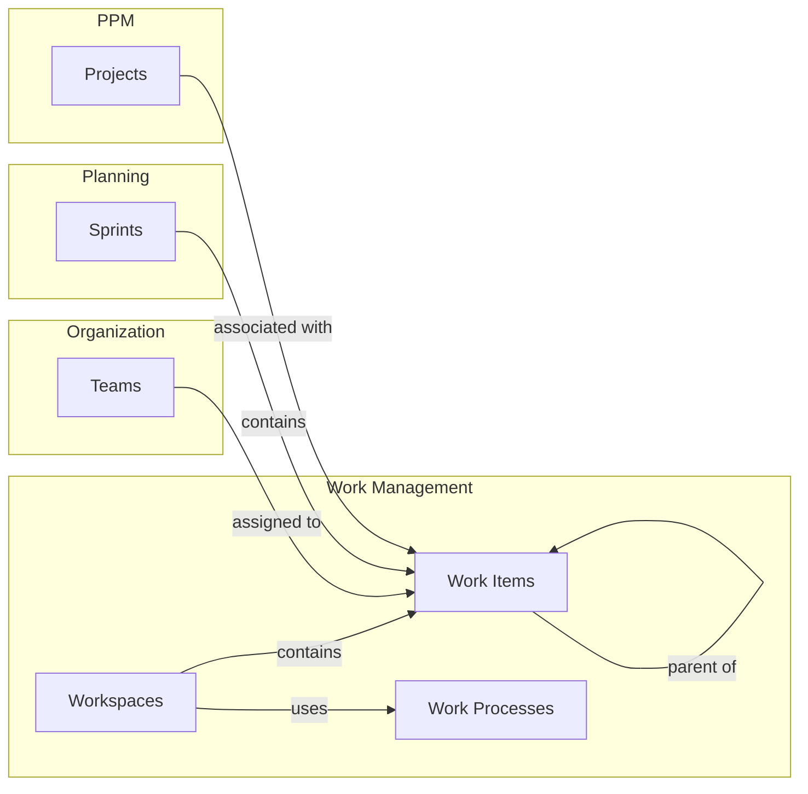

# Work Management

The Work Management domain is the core of Moda, providing capabilities to manage work items across teams with configurable work processes, workflows, and work types. It supports both internally created work and work synchronized from external systems like Azure DevOps.

## How Work Management Connects Across Moda

Work items are the atomic unit of delivery, connecting teams, sprints, and projects:

- **[Teams](../organizations/index#teams)** are assigned to work items and see them on the [Backlog tab](../organizations/index#backlog-tab). Team [dependencies](../organizations/index#dependency-management-tab) and [cycle time](../organizations/index#cycle-time-report-report) are also tracked.
- **[Sprints](../planning/sprints)** provide time-boxed containers for work items. Sprint progress is measured via [sprint metrics](../planning/sprints#sprint-metrics).
- **[Projects](../ppm/projects)** can be associated with portfolio-tier work items. Projects track work on their [Work Items tab](../ppm/projects#project-detail-page).

## Sections

- **[Work Items & Workspaces](./work-items)** — Creating, viewing, and managing work items within workspaces
- **[Work Configuration](./work-configuration)** — Work processes, work types, workflows, and work statuses

## Business Rules Summary

| Rule | Description |
|------|-------------|
| Work process requires types | At least one [work type](./work-configuration#work-types) must be configured |
| Unique types per process | A work type can only appear once in a [work process](./work-configuration#work-processes) |
| Workflow minimum | Owned [workflows](./work-configuration#workflows) require at least three statuses |
| Category coverage | All four [status categories](./work-configuration#work-status-categories) must be represented in a workflow |
| Category ordering | Status categories must be grouped (Proposed > Active > Done > Removed) |
| Status immutability | [Work status](./work-configuration#work-statuses) names cannot be changed |
| Managed read-only | [Work items](./work-items#work-items) in managed [workspaces](./work-items#workspaces) cannot be edited in Moda |
| Parent tier | Only [Portfolio tier](./work-configuration#work-type-tiers) work items can be parents |
| Parent level | Parent must be a higher [level](./work-configuration#work-type-levels) than the child |
| No self-links | Work items cannot be linked to themselves |
| [Dependency health](./work-items#work-item-dependencies) | Automatically calculated from predecessor/successor planned dates |
| Project inheritance | Child work items inherit [project](../ppm/projects) assignment from parent |
