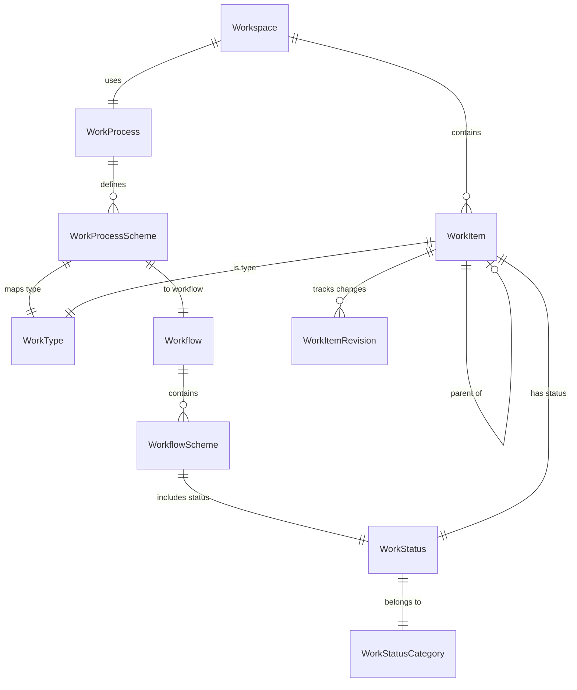

# Work Configuration

Work configuration defines the rules for how [work items](./work-items#work-items) are categorized and how they flow through stages. These settings are managed in [Settings > Work Management](../settings/index#work-management-settings).

## How It All Fits Together

## Work Processes

A **Work Process** defines the configuration of [work types](#work-types) and their [workflows](#workflows) used within a [workspace](./work-items#workspaces). Think of it as a template that determines what kinds of work can be created and how that work flows through stages.

A work process contains a **Work Process Scheme** that links:
- **[Work Types](#work-types)** — What categories of work are available
- **[Workflows](#workflows)** — What status transitions each work type follows

**Business rules:**
- A work process requires at least one work type to be configured
- A work type can only appear once within a work process
- A single work process can be used by multiple [workspaces](./work-items#workspaces)
- Only active work processes can be assigned to workspaces

## Work Types

A **Work Type** represents a category of [work item](./work-items#work-items). Common examples include:
- **Epic** — Large body of work that can be broken into features
- **Feature** — A product capability or deliverable
- **User Story** — A user-centric requirement
- **Task** — A discrete unit of work
- **Bug** — A defect to be fixed

### Work Type Tiers

Work types are organized into **Tiers** that group them by purpose and define [hierarchy rules](./work-items#work-item-hierarchy-rules):

| Tier | Purpose | Hierarchy | Examples |
|------|---------|-----------|----------|
| **Portfolio** | Container work types. Multiple hierarchy levels allowed. | Can be parents | Epic, Feature |
| **Requirement** | Base-level work types representing team work. | Cannot be parents of Portfolio types | User Story, Bug |
| **Task** | Child work types owned by a parent (typically a Requirement). | Must have a parent | Task, Sub-task |
| **Other** | Non-standard work types. Not shown in backlog/iteration views. | No hierarchy | Impediment, Risk Item |

### Work Type Levels

**Work Type Levels** allow work types to be hierarchically ordered and normalized across the system. The system provides default levels:

| Tier | Default Levels |
|------|---------------|
| Portfolio | Epics (Level 1), Features (Level 2) |
| Requirement | Stories (Level 1) |
| Task | Tasks (Level 1) |
| Other | Other (Level 1) |

Custom Portfolio-tier levels can be added to support deeper hierarchies (e.g., a "Theme" level above Epic).

## Workflows

A **Workflow** defines the set of [statuses](#work-statuses) and their ordering that a [work item](./work-items#work-items) goes through from creation to completion. Each work type in a [work process](#work-processes) is assigned a workflow.

A workflow contains a **Workflow Scheme** that defines:
- **[Work Statuses](#work-statuses)** — The available states
- **[Work Status Categories](#work-status-categories)** — The normalization group for each status
- **Order** — The sequence of statuses

**Business rules for owned workflows:**
- At least three work statuses are required
- All four [work status categories](#work-status-categories) must be represented
- Each work status can only appear once in a workflow
- Work status categories must be grouped in order — Proposed first, then Active, then Done, with Removed at the end

**Example workflow:**

| Order | Status | Category |
|-------|--------|----------|
| 1 | New | Proposed |
| 2 | Ready | Proposed |
| 3 | In Progress | Active |
| 4 | In Review | Active |
| 5 | Done | Done |
| 6 | Removed | Removed |

## Work Statuses

A **Work Status** represents a specific state within a [workflow](#workflows) (e.g., "New", "In Progress", "Done"). Work statuses are reusable — the same status can appear in multiple workflows.

**Business rules:**
- The name of a work status cannot be changed — a new name requires creating a new status
- Each work status belongs to a [Work Status Category](#work-status-categories)

## Work Status Categories

**Work Status Categories** normalize statuses across different [workflows](#workflows) for consistent reporting and metrics. They are a fixed set:

| Category | Order | Purpose |
|----------|-------|---------|
| **Proposed** | 1 | Work has been proposed but not yet started |
| **Active** | 2 | Work is currently being performed |
| **Done** | 3 | Work has been completed |
| **Removed** | 4 | Work has been removed from scope without completion |

This normalization enables Moda to calculate metrics like [cycle time](../organizations/index#cycle-time-report-report), throughput, and [completion rates](../planning/sprints#metric-definitions) across [teams](../organizations/index#teams) that may use different workflow configurations.

## Configuration Tasks

### Configuring Work Types

1. Navigate to [Settings > Work Management > Work Types](../settings/index#work-types)
2. Create or modify work types
3. Assign each work type to a [tier](#work-type-tiers) (Portfolio, Requirement, Task, or Other)

### Configuring Work Statuses

1. Navigate to [Settings > Work Management > Work Statuses](../settings/index#work-statuses)
2. Create work statuses with their display names
3. Assign each to a [work status category](#work-status-categories)

### Configuring Work Processes

1. Navigate to [Settings > Work Management > Work Processes](../settings/index#work-processes)
2. Create a work process
3. Add [work types](#work-types) and assign [workflows](#workflows) to each
4. Activate the work process
5. The work process can then be assigned to [workspaces](./work-items#workspaces)
