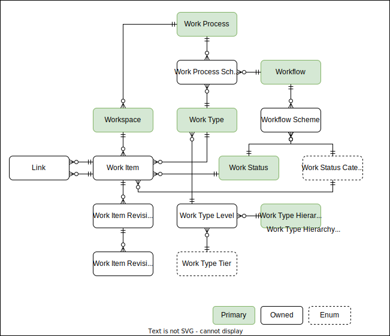

# Work Domain

The work domain provides the capabilities to manage your teams work items.

# Models

- [Workspace](#workspace)
- [Work Item](#work-item)
- [Work Item Revision](#work-item-revision)
- [Work Item Revision Change](#work-item-revision-change)
- [Work Process](#work-process)
- [Work Process Scheme](#work-process-scheme)
- [Work Type](#work-type)
- [Work Type Tier](#work-type-tier)
- [Work Type Level](#work-type-level)
- [Workflow](#workflow)
- [Workflow Scheme](#workflow-scheme)
- [Work Status](#work-status)
- [Work Status Category](#work-status-category)

## Workspace

A workspace is a container for work items.

A workspace is either owned by Moda or managed by an external application and synchronized with Moda.

## Work Item

A work item represents a piece of work that needs to be completed.

## Work Item Revision

The work item revision is a change record for a work item.

## Work Item Revision Change

A specific field change within a work item revision.

## Work Process

The work process defines a set of work process configurations that can be used within a workspace.  A work process can be used in many workspaces.

### Business Rules

- A work process requires at least one work type to be configured.
- A work type can only be defined once within a work process.
- A single work process can be used by multiple workspaces.

## Work Process Scheme

The work process scheme defines work types and their workflows that can be used within the work process.

## Work Type

Represents the type of work item.  Examples:

- Story
- Bug
- Feature
- Epic

## Work Type Tier

An enum that enables work type levels to be grouped based on purpose and functionality and normalized across the organization.

- Portfolio - Portfolio tiers provide a way to group work types into a more granular hierarchical structure.  These work types are containers for lower level work types.  This is the only hierarchy category that allows multiple levels.
- Requirement - The requirement tier contains your base level work types.  These work types represent the work being done by a team.
- Task - The task tier contains work types that are owned and managed by a parent work type.  The parent work type is typically from the requirement tier.
- Other - A tier for non-standard work types.  Work Types in this tier will not appear in backlog or iteration views.  It is used for special work types.  This is also the default tier for new work types.

## Work Type Level

Allows work types to be grouped, defined in a hierarchy, and normalized across the system.  There will be only one owned set of work type levels in the system.  

## Workflow

A workflow is a set of work states that define the different stages a work item must go through to be considered done.

An active workflow is any workflow currently assigned to a process or work item.  When an active workflow is changed, the system will create a new workflow and update existing tickets to the new workflow.

### Business Rules

- An owned workflow requires at least three work states be configured.
- Each of the work state categories must be represented in an owned workflow for it to be valid.
- A work state can only be defined once within a workflow.
- The order of work state categories within the workflow configuration must be grouped.  Proposed items are always at the beginning of the workflow and Done items are always at the end.
  - Valid Example (Order, Work State, Work State Category)
    - 1, New, Proposed
    - 2, In Progress, Active
    - 3, In Review, Active
    - 4, Completed, Done
  - Invalid Example (Order, Work State, Work State Category)
    - 1, New, Proposed
    - 2, In Progress, Active   <-- An Active work state category can not be configured in between configs with Proposed work state categories
    - 3, Ready, Proposed
    - 4, Completed, Done

### Open Questions

- [ ] Future - need to define transitions and rules for owned workspaces.
- [ ] How should we handle changes?  I think workflows should be immutable if are or ever have been assigned.

## Workflow Scheme

The workflow scheme links work states, work state categories, and the order to the workflow.

## Work Status

Represents the status within a workflow.  Each work status can be used in many workflows.

The name of the work status cannot be changed.  A new name represents a new work status.

## Work Status Category

The work status category is an enum that helps sort and normalize work statuses across workflows.  The order and available values are:

1. Proposed - The work has been proposed but not yet started.  This is also useful for workflows that have additional work statuses used to collect requirements, but don't want to consider those as active or in progress.
2. Active - The work is currently being performed.
3. Done - The work has been completed.
4. Removed - The work has been removed from the backlog without being completed.

# ERD

